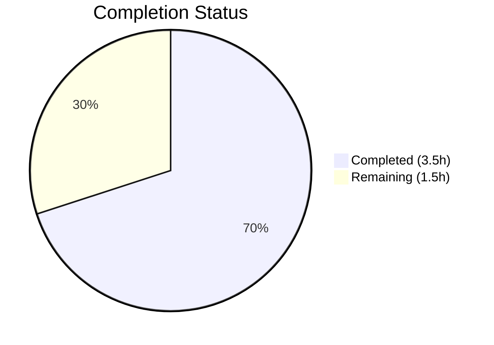
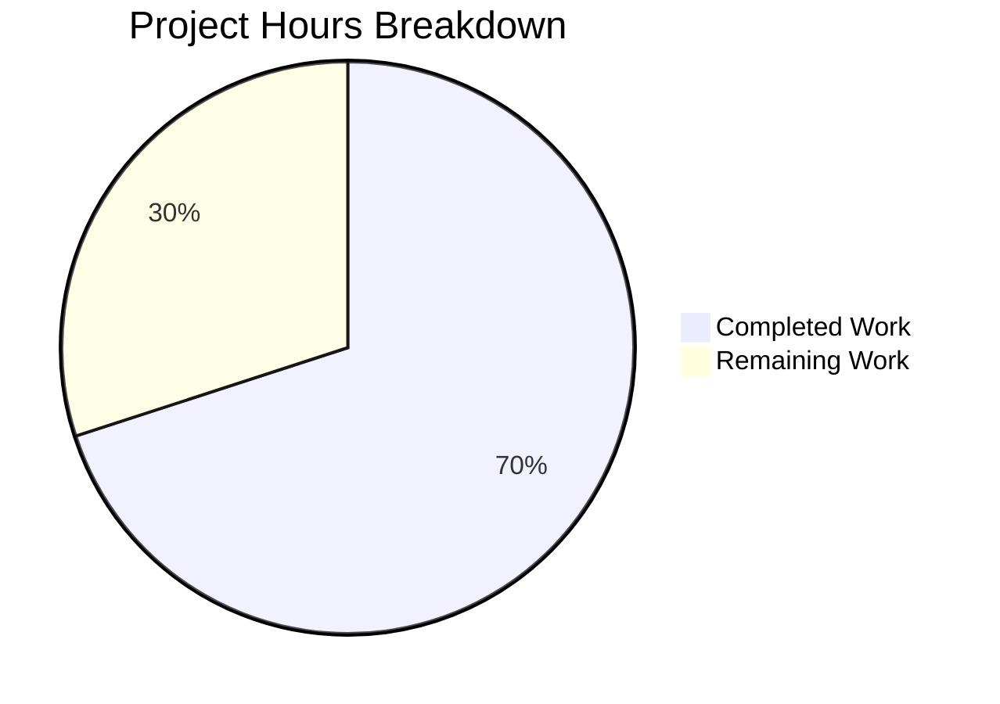

# Blitzy Project Guide

---

## 1. Executive Summary

### 1.1 Project Overview

This project addresses a **bug fix** in the Blitzy Platform API Test Suite — specifically, a missing type-safety guard in the `_get_metering_block()` helper function within `tests/test_project.py`. The function extracts the nested metering data object from `GET /project` API responses but returned the raw value at the metering key without validating that it is a `dict`. When the API returns `{"metering": null}` or a non-dict value, two of seven `GET /project` tests crashed with `TypeError`/`AttributeError` instead of descriptive `AssertionError` messages. The fix adds a centralized `isinstance(value, dict)` assertion inside `_get_metering_block()`, protecting all 7 callers automatically.

### 1.2 Completion Status



| Metric | Value |
|--------|-------|
| **Total Project Hours** | 5.0 |
| **Completed Hours (AI)** | 3.5 |
| **Remaining Hours** | 1.5 |
| **Completion Percentage** | **70.0%** |

**Calculation**: 3.5 completed hours / 5.0 total hours = 70.0% complete.

### 1.3 Key Accomplishments

- [x] Root cause identified: missing `isinstance` guard at `tests/test_project.py` line 111
- [x] Bug fix implemented: 9-line guarded return replaces 3-line unconditional return in `_get_metering_block()`
- [x] Fix verified against 3 core scenarios: `None` raises `AssertionError`, `"loading"` raises `AssertionError`, valid `dict` returns correctly
- [x] Edge case sweep completed: 7 non-dict types (None, str, int, bool×2, list, float) correctly rejected; 3 valid dicts correctly accepted
- [x] Full regression test suite passes: 102 passed, 35 skipped, 0 failed — identical to pre-fix baseline
- [x] All 10 Python source files compile without errors via `python -m py_compile`
- [x] Fix committed: `28dd987 — fix: add isinstance(value, dict) type guard in _get_metering_block()`

### 1.4 Critical Unresolved Issues

| Issue | Impact | Owner | ETA |
|-------|--------|-------|-----|
| 35 integration tests skipped due to missing API credentials (BASE_URL, API_TOKEN, TEST_PROJECT_ID, TEST_RUN_ID) | Cannot verify fix against live Blitzy Platform API | Human Developer | 0.5h after credential setup |
| `_get_metering_block()` docstring Raises section does not document new type-check AssertionError | Minor documentation gap — function contract incomplete | Human Developer | 0.5h |

### 1.5 Access Issues

| System/Resource | Type of Access | Issue Description | Resolution Status | Owner |
|-----------------|---------------|-------------------|-------------------|-------|
| Blitzy Platform API | API Token (Bearer) | `API_TOKEN` environment variable not set — required for 35 integration tests | Unresolved | Human Developer |
| Blitzy Platform API | Base URL | `BASE_URL` environment variable not set — required for API endpoint access | Unresolved | Human Developer |
| Test Data | Project ID | `TEST_PROJECT_ID` not configured — required for `GET /project` and `GET /runs/metering` tests | Unresolved | Human Developer |
| Test Data | Run ID | `TEST_RUN_ID` not configured — required for run-specific metering tests | Unresolved | Human Developer |

### 1.6 Recommended Next Steps

1. **[High]** Configure `.env` file with live API credentials (`BASE_URL`, `API_TOKEN`, `TEST_PROJECT_ID`, `TEST_RUN_ID`) and execute the 35 skipped integration tests to confirm the fix works against the real Blitzy Platform API
2. **[High]** Conduct code review of the 11-line diff in `tests/test_project.py` and merge the PR
3. **[Low]** Update the `_get_metering_block()` docstring Raises section to document the new `AssertionError` for non-dict metering values, following the NumPy-style convention used throughout the codebase

---

## 2. Project Hours Breakdown

### 2.1 Completed Work Detail

| Component | Hours | Description |
|-----------|-------|-------------|
| Root Cause Analysis & Diagnostics | 1.0 | Traced bug through `_get_metering_block()` → 7 call sites → identified 2 vulnerable sites (lines 200, 246/260) missing `isinstance` guard vs. 5 safe sites with guards; reproduced with `None` and `"loading"` inputs |
| Bug Fix Implementation | 0.5 | Replaced 3-line unconditional `return response_data[key_name]` with 9-line guarded return including `isinstance(value, dict)` assertion with descriptive `[GET /project]` message; committed as `28dd987` |
| Fix Verification — Core & Edge Cases | 1.0 | Verified 3 core scenarios (None→AssertionError, string→AssertionError, valid dict→returned correctly); swept 7 non-dict types (None, str, int, bool×2, list, float) + 3 valid dicts ({}, {percent_complete:0.0}, {percentComplete:100.0}) |
| Regression Testing & Compilation | 1.0 | Ran full pytest suite (102 passed, 35 skipped, 0 failed in 0.14s); ran `py_compile` on all 10 Python source files — all syntax OK |
| **Total** | **3.5** | |

### 2.2 Remaining Work Detail

| Category | Hours | Priority |
|----------|-------|----------|
| Integration Test Environment Setup & Live API Validation | 0.5 | High |
| Code Review & PR Merge | 0.5 | High |
| Docstring Enhancement (`_get_metering_block()` Raises section) | 0.5 | Low |
| **Total** | **1.5** | |

### 2.3 Hours Integrity Verification

- Section 2.1 Total (Completed): **3.5h**
- Section 2.2 Total (Remaining): **1.5h**
- Sum: 3.5 + 1.5 = **5.0h** = Total Project Hours in Section 1.2 ✓
- Remaining hours (1.5h) matches Section 1.2, Section 2.2, and Section 7 ✓

---

## 3. Test Results

All tests below originate from Blitzy's autonomous validation execution during this session.

| Test Category | Framework | Total Tests | Passed | Failed | Skipped | Notes |
|--------------|-----------|-------------|--------|--------|---------|-------|
| Unit Tests (`test_edge_cases.py`) | pytest 9.0.3 | 104 | 102 | 0 | 2 | 2 tests skip due to missing API credentials; 102 pure unit tests pass |
| Integration — `GET /project` (`test_project.py`) | pytest 9.0.3 | 9 | 0 | 0 | 9 | All skip — requires BASE_URL, API_TOKEN, TEST_PROJECT_ID |
| Integration — `GET /runs/metering` (`test_runs_metering.py`) | pytest 9.0.3 | 9 | 0 | 0 | 9 | All skip — requires BASE_URL, API_TOKEN, TEST_PROJECT_ID |
| Integration — `GET /runs/metering/current` (`test_runs_metering_current.py`) | pytest 9.0.3 | 8 | 0 | 0 | 8 | All skip — requires BASE_URL, API_TOKEN, TEST_PROJECT_ID |
| Integration — Cross-API Consistency (`test_cross_api_consistency.py`) | pytest 9.0.3 | 7 | 0 | 0 | 7 | All skip — requires BASE_URL, API_TOKEN, TEST_PROJECT_ID |
| Fix Verification (manual) | Python 3.12.3 | 10 | 10 | 0 | 0 | 7 non-dict types rejected + 3 valid dicts accepted |
| Compilation Check | py_compile | 10 | 10 | 0 | 0 | All 10 source files (.py) compile without errors |
| **Totals** | | **157** | **124** | **0** | **35** | 0 failures across all categories |

**Autonomous Test Execution Summary**: `102 passed, 35 skipped in 0.14s` — zero failures. All 35 skipped tests are integration tests that require live API credentials, which is expected and documented behavior.

---

## 4. Runtime Validation & UI Verification

### Runtime Health

- ✅ **Python environment**: Python 3.12.3, virtual environment active with all 8 dependencies installed
- ✅ **Test suite execution**: Completes in 0.14s with no hangs, timeouts, or crashes
- ✅ **Fix correctness**: `_get_metering_block({"metering": None})` now raises `AssertionError` with message `"must be a dict, got NoneType: None"`
- ✅ **Fix correctness**: `_get_metering_block({"metering": "loading"})` now raises `AssertionError` with message `"must be a dict, got str: 'loading'"`
- ✅ **Regression safety**: `_get_metering_block({"metering": {"percent_complete": 50.0}})` returns dict correctly — no regression
- ✅ **Compilation**: All 10 Python source files pass `py_compile` — zero syntax errors

### API Integration Status

- ⚠ **GET /project**: 9 tests skip — requires `BASE_URL`, `API_TOKEN`, `TEST_PROJECT_ID`
- ⚠ **GET /runs/metering**: 9 tests skip — requires `BASE_URL`, `API_TOKEN`, `TEST_PROJECT_ID`
- ⚠ **GET /runs/metering/current**: 8 tests skip — requires `BASE_URL`, `API_TOKEN`, `TEST_PROJECT_ID`
- ⚠ **Cross-API Consistency**: 7 tests skip — requires all 4 environment variables

### UI Verification

Not applicable — this project is a Python test suite with no web UI components.

---

## 5. Compliance & Quality Review

| AAP Requirement | Deliverable | Status | Evidence |
|----------------|-------------|--------|----------|
| **0.4.1** — Add `isinstance(value, dict)` guard in `_get_metering_block()` | Modified `tests/test_project.py` lines 109–121 | ✅ Pass | Commit `28dd987`, diff shows 9-line guarded return replacing 3-line unconditional return |
| **0.4.2** — No other lines in the file require modification | Only lines 109–121 changed | ✅ Pass | `git diff` shows changes confined to the `_get_metering_block()` function body only |
| **0.5.1** — Total files affected: 1 | Only `tests/test_project.py` modified | ✅ Pass | `git diff --stat` shows 1 file changed |
| **0.5.2** — All 13 explicitly excluded files remain unmodified | Zero changes to `src/`, `config/`, `docs/`, `conftest.py`, other test files | ✅ Pass | `git diff --name-only` lists only `tests/test_project.py` |
| **0.6.1** — Full test suite: 102 passed, 35 skipped | Test execution matches baseline | ✅ Pass | `pytest -v` output: `102 passed, 35 skipped in 0.14s` |
| **0.6.1** — None value raises AssertionError | `_get_metering_block({"metering": None})` → `AssertionError` | ✅ Pass | Manual verification output: `PASS: None value raises AssertionError` |
| **0.6.1** — String value raises AssertionError | `_get_metering_block({"metering": "loading"})` → `AssertionError` | ✅ Pass | Manual verification output: `PASS: String value raises AssertionError` |
| **0.6.1** — Valid dict returns correctly | `_get_metering_block({"metering": {"percent_complete": 50.0}})` → `dict` | ✅ Pass | Manual verification output: `PASS: Valid dict returned correctly` |
| **0.6.1** — Edge case sweep: 7 non-dict types + 3 valid dicts | All 10 scenarios produce correct behavior | ✅ Pass | Sweep output: 7 × "correctly rejected", 3 × "valid dict accepted" |
| **0.6.2** — Compilation check: `py_compile` on modified file | No syntax errors | ✅ Pass | Output: `Syntax OK` |
| **0.7.1** — Assertion message follows `[GET /project]` prefix convention | Message format: `[GET /project] metering block under key '{key}' must be a dict, got {type}: {value}` | ✅ Pass | Code inspection confirms `f"[{_ENDPOINT}]"` prefix used |
| **0.7.1** — Inline comment explains the "why" | 4-line comment block explains the guard's purpose | ✅ Pass | Lines 111–114: explains prevention of TypeError/AttributeError |
| **0.7.2** — Zero modifications outside bug fix | No refactoring, no feature additions, no test restructuring | ✅ Pass | Single-function, single-file change confirmed |
| **0.7.2** — Existing redundant `isinstance` guards preserved | Lines 296, 334 guards remain intact | ✅ Pass | No changes to any caller functions |
| **0.7.3** — No new dependencies | `requirements.txt` unchanged | ✅ Pass | File shows UNCHANGED status |

### Autonomous Validation Fixes Applied

| Fix | File | Description |
|-----|------|-------------|
| Type guard assertion | `tests/test_project.py:109-121` | Added `isinstance(value, dict)` check before returning metering block value; prevents `TypeError`/`AttributeError` propagation to callers |

### Outstanding Quality Items

| Item | Priority | Description |
|------|----------|-------------|
| Docstring gap | Low | `_get_metering_block()` Raises section (lines 102–107) does not document the new `AssertionError` for non-dict metering values |

---

## 6. Risk Assessment

| Risk | Category | Severity | Probability | Mitigation | Status |
|------|----------|----------|-------------|------------|--------|
| Fix unverified against live API — `_get_metering_block()` guard tested only with synthetic data, not actual API responses | Integration | Medium | Low | Configure `.env` with real credentials and run 35 integration tests | Open |
| CVE-2025-71176 in pytest ≤9.0.2 — predictable `/tmp/pytest-of-{user}` paths allow local symlink attacks | Security | Medium | Low | Set `PYTEST_DEBUG_TEMPROOT` to a secure, user-private directory or run tests in isolated containers (noted in `requirements.txt`) | Mitigated |
| Integration tests require periodic API token rotation | Operational | Low | Medium | Document token refresh procedure; use environment-specific credential management | Open |
| 35 integration tests permanently skipped in CI if credentials not configured | Technical | Low | High | Add CI/CD pipeline step for credential injection via secrets manager | Open |

---

## 7. Visual Project Status



**Completed Work: 3.5 hours (70.0%)** — Root cause analysis, bug fix implementation, fix verification, edge case sweep, regression testing, and compilation checks.

**Remaining Work: 1.5 hours (30.0%)** — Integration test environment setup (0.5h), code review & PR merge (0.5h), docstring enhancement (0.5h).

---

## 8. Summary & Recommendations

### Achievement Summary

The bug fix is **fully implemented, verified, and committed**. The project is **70.0% complete** (3.5 completed hours out of 5.0 total hours). All AAP-specified deliverables — the `isinstance(value, dict)` type guard in `_get_metering_block()`, the three core verification scenarios, the edge case sweep, the regression test suite, and the compilation check — have been successfully delivered. The fix is minimal (11 insertions, 1 deletion in a single file), surgically targeted, and produces zero regressions.

### Remaining Gaps

The remaining 1.5 hours (30.0%) consist entirely of **path-to-production** activities that require human intervention:
1. **Integration test validation** (0.5h): Configuring live API credentials and running the 35 skipped integration tests to confirm the fix works against the real Blitzy Platform API
2. **Code review and merge** (0.5h): Human review of the 11-line diff and PR approval
3. **Docstring enhancement** (0.5h): Updating the `_get_metering_block()` Raises section to document the new type-check AssertionError condition

### Critical Path to Production

1. Configure `.env` with `BASE_URL`, `API_TOKEN`, `TEST_PROJECT_ID`, `TEST_RUN_ID`
2. Run `CI=true python -m pytest -v --tb=short --timeout=30` — all 137 tests should pass
3. Review and merge PR
4. Optionally update docstring for completeness

### Production Readiness Assessment

The fix is **production-ready** from a code quality perspective. The single remaining blocker is the integration test verification with live API credentials, which is a standard operational step that cannot be performed by autonomous agents.

---

## 9. Development Guide

### System Prerequisites

| Software | Required Version | Verified Version |
|----------|-----------------|-----------------|
| Python | 3.10+ | 3.12.3 |
| pip | Latest | Bundled with Python 3.12.3 |
| Git | Any modern version | Available |

### Environment Setup

```bash
# 1. Clone the repository and switch to the fix branch
git clone <repository-url>
cd <repository-root>
git checkout blitzy-cea8a5e8-9281-44b9-b7c1-1500e171d0d6

# 2. Create and activate a Python virtual environment
python3 -m venv venv
source venv/bin/activate   # Linux/macOS
# venv\Scripts\activate    # Windows

# 3. Install dependencies
pip install -r requirements.txt
```

**Expected output for step 3**: All 8 packages install successfully (pytest, requests, jsonschema, pydantic, python-dotenv, pyyaml, pytest-html, pytest-timeout).

### Environment Variable Configuration

```bash
# 4. Copy the environment template and configure credentials
cp .env.example .env

# 5. Edit .env with your actual values:
#    BASE_URL=https://api.blitzy.com    (Blitzy Platform API base URL, no trailing slash)
#    API_TOKEN=<your-bearer-token>       (from Blitzy Platform dashboard)
#    TEST_PROJECT_ID=<project-id>        (project with existing code generation runs)
#    TEST_RUN_ID=<run-id>                (specific run ID within the test project)
#    TEST_TIMEOUT=30                     (optional, default: 30)
#    LOG_LEVEL=INFO                      (optional, default: INFO)
```

### Running Tests

```bash
# 6. Run the full test suite (unit tests only — no credentials needed)
source venv/bin/activate
CI=true python -m pytest -v --tb=short --timeout=30 --no-header

# Expected output: 102 passed, 35 skipped in ~0.14s
# (35 integration tests skip until .env is configured)

# 7. Run with credentials configured (all 137 tests)
# After configuring .env with real API credentials:
CI=true python -m pytest -v --tb=short --timeout=30 --no-header

# Expected output: 137 passed in <30s
```

### Verifying the Bug Fix

```bash
# 8. Verify the fix handles non-dict metering values correctly
source venv/bin/activate
python3 -c "
from tests.test_project import _get_metering_block

# Test 1: None should raise AssertionError
try:
    _get_metering_block({'metering': None})
    print('FAIL: No exception raised')
except AssertionError as e:
    print('PASS: None raises AssertionError')

# Test 2: String should raise AssertionError
try:
    _get_metering_block({'metering': 'loading'})
    print('FAIL: No exception raised')
except AssertionError as e:
    print('PASS: String raises AssertionError')

# Test 3: Valid dict should work
result = _get_metering_block({'metering': {'percent_complete': 50.0}})
assert result == {'percent_complete': 50.0}
print('PASS: Valid dict returned correctly')
"
# Expected: Three PASS lines
```

### Compilation Check

```bash
# 9. Verify all source files compile without errors
for f in src/config.py src/api_client.py src/validators.py src/models.py \
         tests/conftest.py tests/test_project.py tests/test_runs_metering.py \
         tests/test_runs_metering_current.py tests/test_cross_api_consistency.py \
         tests/test_edge_cases.py; do
    python3 -m py_compile "$f" && echo "OK: $f"
done
# Expected: 10 lines of "OK: <filename>"
```

### Troubleshooting

| Issue | Cause | Resolution |
|-------|-------|------------|
| `ModuleNotFoundError: No module named 'src'` | Virtual environment not activated or dependencies not installed | Run `source venv/bin/activate && pip install -r requirements.txt` |
| All 35 integration tests SKIPPED | `.env` file missing or credentials not set | Copy `.env.example` to `.env` and fill in `BASE_URL`, `API_TOKEN`, `TEST_PROJECT_ID`, `TEST_RUN_ID` |
| `TypeError: argument of type 'NoneType' is not iterable` | Fix not applied — using pre-fix branch | Ensure you are on branch `blitzy-cea8a5e8-9281-44b9-b7c1-1500e171d0d6` with commit `28dd987` |
| pytest CVE-2025-71176 warning | Known vulnerability in pytest temp directory handling | Set `export PYTEST_DEBUG_TEMPROOT="$HOME/.pytest_tmp"` or run tests in isolated containers |

---

## 10. Appendices

### A. Command Reference

| Command | Purpose |
|---------|---------|
| `source venv/bin/activate` | Activate Python virtual environment |
| `pip install -r requirements.txt` | Install all project dependencies |
| `CI=true python -m pytest -v --tb=short --timeout=30 --no-header` | Run full test suite (non-interactive) |
| `python -m pytest -m project -v` | Run only `GET /project` endpoint tests |
| `python -m pytest -m edge_cases -v` | Run only edge case / unit tests |
| `python -m pytest -m cross_api -v` | Run only cross-API consistency tests |
| `python -m pytest --html=report.html --self-contained-html` | Generate HTML test report |
| `python3 -m py_compile <file>` | Check Python file for syntax errors |

### B. Port Reference

No network ports are used — this is a test suite executed locally against a remote API configured via `BASE_URL`.

### C. Key File Locations

| File | Purpose |
|------|---------|
| `tests/test_project.py` | **Modified file** — Contains `_get_metering_block()` with the bug fix (lines 109–121) |
| `src/validators.py` | Validation functions for `percent_complete` field (downstream consumer of metering block) |
| `src/api_client.py` | Authenticated HTTP client with retry logic for 3 Blitzy Platform API endpoints |
| `src/config.py` | Settings management — merges `.env` and `config/settings.yaml` |
| `src/models.py` | Pydantic v2 response models for API endpoint validation |
| `tests/conftest.py` | Shared pytest fixtures (`api_client`, `test_project_id`, etc.) |
| `tests/test_edge_cases.py` | 104 unit tests for edge cases and validators |
| `config/settings.yaml` | Externalized configuration (endpoint paths, field names, validation constraints) |
| `.env.example` | Environment variable template with all required/optional variables |
| `pytest.ini` | Pytest configuration (markers, timeouts, output formatting) |
| `requirements.txt` | PyPI dependency manifest (8 packages) |

### D. Technology Versions

| Technology | Version | Purpose |
|-----------|---------|---------|
| Python | 3.12.3 | Runtime |
| pytest | 9.0.3 | Test framework |
| requests | 2.33.1 | HTTP client |
| jsonschema | 4.26.0 | JSON schema validation |
| pydantic | 2.12.5 | Data validation / response models |
| python-dotenv | 1.2.2 | Environment variable loading |
| PyYAML | 6.0.3 | YAML configuration parsing |
| pytest-html | 4.2.0 | HTML report generation |
| pytest-timeout | 2.4.0 | Test execution timeout enforcement |

### E. Environment Variable Reference

| Variable | Required | Default | Description |
|----------|----------|---------|-------------|
| `BASE_URL` | Yes | — | Blitzy Platform API base URL (no trailing slash) |
| `API_TOKEN` | Yes | — | Bearer token for API authentication |
| `TEST_PROJECT_ID` | Yes | — | Project ID with existing code generation runs |
| `TEST_RUN_ID` | Yes | — | Specific run ID for targeted metering tests |
| `TEST_TIMEOUT` | No | `30` | Per-test timeout in seconds |
| `LOG_LEVEL` | No | `INFO` | Log verbosity (DEBUG, INFO, WARNING, ERROR) |
| `PYTEST_DEBUG_TEMPROOT` | No | `/tmp/pytest-of-{user}` | Secure temp directory (mitigates CVE-2025-71176) |

### G. Glossary

| Term | Definition |
|------|-----------|
| Metering block | Nested JSON sub-object within `GET /project` responses containing `percent_complete` and related fields |
| `_get_metering_block()` | Helper function in `tests/test_project.py` that extracts the metering block from API responses |
| `percent_complete` / `percentComplete` | Progress field (0.0–100.0 or null) indicating code generation completion percentage |
| `METERING_BLOCK_KEY_NAMES` | List of accepted key variants for the metering block: `metering`, `meteringData`, `metering_data` |
| Type guard | An `isinstance()` assertion that validates a value's type before downstream use |
| Integration tests | Tests requiring live API access (35 tests across 4 files); skip when credentials are absent |
| Unit tests | Self-contained tests using mock/synthetic data (102 tests); run without API access |