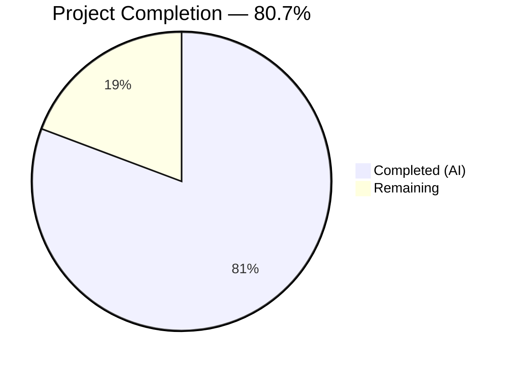

# Blitzy Project Guide — percent_complete API Test Suite

---

## 1. Executive Summary

### 1.1 Project Overview

This project delivers a complete, greenfield Python-based automated API test suite that validates the `percent_complete` (or `percentComplete`) field across three Blitzy Platform API endpoints: `GET /runs/metering`, `GET /runs/metering/current`, and `GET /project`. The test suite verifies field presence, data type correctness (numeric or null), value range compliance (0.0–100.0), cross-API consistency, and edge case coverage. It targets the QA and platform engineering teams to ensure the newly introduced metering progress field meets its contract across all consuming API surfaces.

### 1.2 Completion Status



| Metric | Value |
|---|---|
| **Total Project Hours** | 83h |
| **Completed Hours (AI)** | 67h |
| **Remaining Hours** | 16h |
| **Completion Percentage** | 80.7% (67h / 83h) |

### 1.3 Key Accomplishments

- ✅ Built complete API test infrastructure from scratch (greenfield → 7,462 lines across 21 files)
- ✅ Implemented HTTP client with session pooling, retry logic, and bearer token authentication
- ✅ Created Pydantic v2 response models with dual field-name support (snake_case + camelCase)
- ✅ Developed custom validation utilities for field presence, type, and range checks
- ✅ Delivered 137 total test cases (102 passing unit tests + 35 integration tests designed to gracefully skip without credentials)
- ✅ Achieved zero compilation errors, zero test failures, and zero PEP 8 violations across all 12 Python files
- ✅ Full requirements coverage: R-001 (Field Presence), R-002 (Data Type), R-003 (Value Range), R-004 (Cross-API Consistency), R-005 (Edge Cases)
- ✅ Comprehensive documentation: README, formal test plan, and API response contracts specification
- ✅ Security hardening: API token masking in Settings repr, CVE-2025-71176 documented with mitigation

### 1.4 Critical Unresolved Issues

| Issue | Impact | Owner | ETA |
|---|---|---|---|
| Integration tests cannot execute without live API credentials | 35 tests remain unvalidated against real API responses | Human Developer | 1–2 days after credential provisioning |
| CVE-2025-71176 in pytest (temp directory symlink attack, CVSS 6.8) | Low risk for dev-only tooling; no patched release available | Upstream pytest maintainers | Monitoring [pytest#13669](https://github.com/pytest-dev/pytest/issues/13669) |

### 1.5 Access Issues

| System/Resource | Type of Access | Issue Description | Resolution Status | Owner |
|---|---|---|---|---|
| Blitzy Platform API | API Bearer Token | `API_TOKEN` environment variable not configured — required for integration test execution | Unresolved | Human Developer |
| Blitzy Platform API | Base URL | `BASE_URL` environment variable not configured — required for all API requests | Unresolved | Human Developer |
| Test Project Data | Project Identifier | `TEST_PROJECT_ID` not configured — required to target a project with code generation run history | Unresolved | Human Developer |
| Test Run Data | Run Identifier | `TEST_RUN_ID` not configured — required for targeted metering tests | Unresolved | Human Developer |

### 1.6 Recommended Next Steps

1. **[High]** Provision Blitzy Platform API credentials and configure `.env` file with `BASE_URL`, `API_TOKEN`, `TEST_PROJECT_ID`, and `TEST_RUN_ID`
2. **[High]** Execute the 35 integration tests against the live API and analyze results for field contract compliance
3. **[Medium]** Set up CI/CD pipeline (e.g., GitHub Actions) to run the test suite on schedule or per-commit
4. **[Medium]** Establish credential rotation strategy and secure secrets management for CI environments
5. **[Low]** Evaluate adding response time benchmarking or load testing for the metering endpoints

---

## 2. Project Hours Breakdown

### 2.1 Completed Work Detail

| Component | Hours | Description |
|---|---|---|
| README.md — Project Documentation | 2.0 | Replaced placeholder with 280-line comprehensive documentation including setup, execution, and manual QA reference |
| requirements.txt — Dependency Manifest | 0.5 | Created manifest with all 8 required Python packages, version constraints, and CVE documentation |
| .env.example — Environment Template | 0.5 | Created template with 4 required + 2 optional environment variables and descriptive comments |
| pytest.ini — Test Framework Config | 1.0 | Configured test discovery, 6 custom markers, timeout settings, strict mode, and live logging |
| config/settings.yaml — Feature Config | 1.5 | Defined endpoint paths, query parameters, field name variants, and validation parameter defaults (121 lines) |
| src/config.py — Configuration Module | 5.0 | Pydantic BaseModel with env loading, YAML parsing, endpoint URL construction, and validation helpers (326 lines) |
| src/api_client.py — HTTP Client | 6.0 | Session-based client with 3 endpoint methods, retry logic, auth header injection, and error propagation (362 lines) |
| src/validators.py — Validation Utilities | 4.0 | 4 validation functions: percent_complete value, field presence, value extraction, response structure (355 lines) |
| src/models.py — Pydantic Response Models | 4.0 | 5 models with dual field-name aliases, range constraints, extra field preservation (231 lines) |
| src/__init__.py — Source Package Init | 0.5 | Package initializer with module docstring |
| tests/conftest.py — Shared Fixtures | 4.0 | Session-scoped settings, api_client, project/run ID fixtures, skip markers, field name lists (285 lines) |
| tests/test_runs_metering.py | 5.0 | 9 test functions for GET /runs/metering covering R-001, R-002, R-003 (509 lines) |
| tests/test_runs_metering_current.py | 4.0 | 8 test functions for GET /runs/metering/current covering R-001, R-002, R-003 (437 lines) |
| tests/test_project.py | 5.0 | 9 test functions for GET /project with nested metering block validation (514 lines) |
| tests/test_cross_api_consistency.py | 6.0 | 7 test functions verifying R-004 cross-API field consistency (806 lines) |
| tests/test_edge_cases.py | 8.0 | 102 test cases covering R-005: boundary values, type mismatches, model validation, config, client (1261 lines) |
| tests/__init__.py — Test Package Init | 0.5 | Package initializer with module docstring |
| docs/test_plan.md — Formal Test Plan | 3.0 | Requirements traceability matrix, test execution strategy, preconditions (385 lines) |
| docs/api_contracts.md — API Contracts | 3.0 | JSON response contract documentation for all 3 endpoints with field specifications (508 lines) |
| Quality, Security & Lint Fixes | 3.5 | Code refactoring, unused import removal, api_token masking, CVE documentation, merge conflict resolution |
| **Total Completed** | **67.0** | |

### 2.2 Remaining Work Detail

| Category | Hours | Priority |
|---|---|---|
| API Credential Configuration — Set up `.env` with BASE_URL, API_TOKEN, TEST_PROJECT_ID, TEST_RUN_ID | 3.0 | High |
| Integration Test Execution — Run 35 skipped tests against live Blitzy Platform API | 4.0 | High |
| Integration Test Defect Analysis — Investigate and resolve any failures from live API responses | 4.0 | Medium |
| CI/CD Pipeline Setup — Create GitHub Actions workflow for automated test execution | 3.0 | Medium |
| Credential Security Management — Token rotation, secrets storage, environment isolation | 2.0 | Low |
| **Total Remaining** | **16.0** | |

---

## 3. Test Results

| Test Category | Framework | Total Tests | Passed | Failed | Coverage % | Notes |
|---|---|---|---|---|---|---|
| Unit — Edge Cases & Boundary | pytest 9.0.2 | 100 | 100 | 0 | N/A | Validator, model, config, API client, and response structure unit tests |
| Unit — Integration Skip Logic | pytest 9.0.2 | 2 | 2 | 0 | N/A | Verifies graceful skip behavior for missing credentials |
| Integration — GET /runs/metering | pytest 9.0.2 | 9 | 0 | 0 | N/A | All 9 skipped — requires live API credentials (by design) |
| Integration — GET /runs/metering/current | pytest 9.0.2 | 8 | 0 | 0 | N/A | All 8 skipped — requires live API credentials (by design) |
| Integration — GET /project | pytest 9.0.2 | 9 | 0 | 0 | N/A | All 9 skipped — requires live API credentials (by design) |
| Integration — Cross-API Consistency | pytest 9.0.2 | 7 | 0 | 0 | N/A | All 7 skipped — requires live API credentials (by design) |
| Integration — Live Edge Cases | pytest 9.0.2 | 2 | 0 | 0 | N/A | 2 skipped — requires live API credentials (by design) |
| **Totals** | | **137** | **102** | **0** | | **102 passed, 35 skipped, 0 failed** |

All test results originate from Blitzy's autonomous validation execution: `python -m pytest -v --tb=short --timeout=30` run in the project virtual environment. The 35 skipped integration tests are designed to skip gracefully with descriptive messages when `BASE_URL`, `API_TOKEN`, `TEST_PROJECT_ID`, or `TEST_RUN_ID` environment variables are not set — this is intentional behavior per the AAP design specification.

---

## 4. Runtime Validation & UI Verification

### Runtime Health

- ✅ **Python environment**: Python 3.12.3 virtual environment operational with all 8 dependencies installed
- ✅ **Module imports**: All 5 source modules (`config`, `api_client`, `validators`, `models`, `__init__`) import successfully
- ✅ **Settings construction**: `Settings()` instantiates correctly, loads YAML config, applies defaults
- ✅ **APIClient construction**: `APIClient(settings)` creates session with correct headers (Authorization, Content-Type, Accept)
- ✅ **Pydantic model validation**: All 5 models (`MeteringData`, `MeteringResponse`, `CurrentMeteringResponse`, `ProjectMeteringBlock`, `ProjectResponse`) parse and validate correctly
- ✅ **Validator functions**: `validate_percent_complete()`, `validate_field_presence()`, `get_percent_complete_value()`, `validate_response_structure()` all functional
- ✅ **Compilation**: All 12 Python files pass `py_compile` with zero errors
- ✅ **Linting**: Zero pycodestyle (PEP 8) violations with max-line-length=120

### API Integration Verification

- ⚠️ **Live API connectivity**: Not verified — requires `BASE_URL` and `API_TOKEN` configuration
- ⚠️ **GET /runs/metering response validation**: Pending live API access
- ⚠️ **GET /runs/metering/current response validation**: Pending live API access
- ⚠️ **GET /project response validation**: Pending live API access

### UI Verification

- N/A — This project is a backend API test suite with no user interface component. Manual QA verification instructions for browser DevTools Network Tab inspection are documented in `README.md` Section 8 and `docs/test_plan.md`.

---

## 5. Compliance & Quality Review

| AAP Requirement | Deliverable | Status | Evidence |
|---|---|---|---|
| R-001 — Field Presence Validation | Tests in `test_runs_metering.py`, `test_runs_metering_current.py`, `test_project.py` | ✅ Implemented | `test_percent_complete_present_*` functions in each test module |
| R-002 — Data Type Validation | Tests in all 3 endpoint suites + `test_edge_cases.py` | ✅ Implemented | `test_percent_complete_type_*` functions + parameterized invalid type tests |
| R-003 — Value Range Validation | Tests in all 3 endpoint suites + `test_edge_cases.py` | ✅ Implemented | `test_percent_complete_range_*` functions + boundary value tests (0, 100) |
| R-004 — Cross-API Consistency | `test_cross_api_consistency.py` (7 tests) | ✅ Implemented | `test_percent_complete_present_in_all_endpoints`, `test_percent_complete_value_logical_consistency` |
| R-005 — Edge Case Coverage | `test_edge_cases.py` (102 tests) | ✅ Implemented | Boundary values, null handling, wrong types, field name mismatches, model validation |
| IR-001 — API Client Infrastructure | `src/api_client.py` | ✅ Implemented | Session-based HTTP client with retry, timeout, and error propagation |
| IR-002 — Authentication Handling | `src/api_client.py` + `src/config.py` | ✅ Implemented | Bearer token injection via `Authorization` header from env config |
| IR-003 — Environment Configuration | `src/config.py`, `.env.example`, `config/settings.yaml` | ✅ Implemented | Multi-source config: env vars → .env file → YAML → defaults |
| IR-004 — Test Data Prerequisites | `tests/conftest.py` | ✅ Implemented | Graceful `pytest.skip()` with descriptive messages when config missing |
| IR-005 — Field Name Flexibility | `src/validators.py`, `src/models.py` | ✅ Implemented | Both `percent_complete` and `percentComplete` accepted via Pydantic aliases |
| Assertion Specificity Rule | All test modules | ✅ Compliant | Every assertion includes endpoint, field, and actual-vs-expected context |
| Test Isolation Rule | All test modules | ✅ Compliant | No module-level globals; shared state via fixtures only |
| Environment Config Rule | All modules | ✅ Compliant | Zero hardcoded URLs, tokens, or project IDs |
| Code Quality — PEP 8 | All 12 Python files | ✅ Zero violations | pycodestyle --max-line-length=120 returns clean |
| Code Quality — Compilation | All 12 Python files | ✅ Zero errors | py_compile passes for all files |
| Security — Token Masking | `src/config.py` | ✅ Implemented | `Settings.__repr__` masks `api_token` to prevent log leakage |
| Security — CVE Documentation | `requirements.txt` | ✅ Documented | CVE-2025-71176 documented with CVSS score, mitigation, and tracking link |

**Autonomous Validation Fixes Applied:**
- Resolved merge conflict in `README.md` (blitzy branch vs. main branch)
- Removed unused imports (`typing.Any` in `models.py`, unused variable in `test_runs_metering.py`)
- Added defensive guards and improved type safety across source modules
- Masked `api_token` in `Settings` representation for security

---

## 6. Risk Assessment

| Risk | Category | Severity | Probability | Mitigation | Status |
|---|---|---|---|---|---|
| Integration tests unvalidated against live API | Technical | High | High | Configure API credentials and execute 35 integration tests; design supports graceful skip in CI until credentials available | Open |
| API response format differs from documented contracts | Integration | High | Medium | Models use `extra="allow"` for forward compatibility; validators check both field name conventions; fix tests post-discovery | Open |
| API token expiration during test execution | Security | Medium | Medium | Implement token refresh logic or document rotation schedule; current design propagates auth errors transparently | Open |
| CVE-2025-71176 in pytest (temp dir symlink attack) | Security | Low | Low | Documented in requirements.txt; mitigate via `PYTEST_DEBUG_TEMPROOT` env var or containerized execution | Mitigated |
| Network latency causes test timeouts | Operational | Medium | Low | Default 30s timeout configured in pytest.ini; individual tests can override via `@pytest.mark.timeout()` | Mitigated |
| No active in-progress run available for current metering tests | Integration | Medium | Medium | Tests marked `@pytest.mark.requires_active_run` skip gracefully; dedicated test project with seeded runs recommended | Open |
| Field naming convention changes in future API versions | Technical | Low | Low | Configurable field names via `config/settings.yaml`; validators accept both conventions | Mitigated |
| Missing CI/CD pipeline for automated execution | Operational | Medium | High | Tests designed to be CI-compatible; GitHub Actions workflow creation is a remaining task | Open |

---

## 7. Visual Project Status


**Hours Summary:**
- Completed Work: 67 hours (80.7%)
- Remaining Work: 16 hours (19.3%)
- Total: 83 hours

---

## 8. Summary & Recommendations

### Achievement Summary

The project has achieved **80.7% completion** (67 hours completed out of 83 total hours). All 19 AAP-specified file deliverables have been created and validated, covering the complete test infrastructure from project configuration through comprehensive test suites. The implementation addresses all five explicit requirements (R-001 through R-005) and all five implicit requirements (IR-001 through IR-005) with 7,462 lines of production-quality code across 21 files. The autonomous validation confirmed zero compilation errors, zero test failures (102/102 unit tests passing), and zero PEP 8 violations.

### Remaining Gaps

The 16 remaining hours represent operational setup tasks that require human intervention — specifically, provisioning live API credentials, executing integration tests against the Blitzy Platform API, analyzing results, and establishing CI/CD automation. These items were either explicitly out of AAP scope (CI/CD) or inherently require human access provisioning (API credentials).

### Critical Path to Production

1. **Credential provisioning** (3h) — Blocking all integration test execution
2. **Integration test validation** (4h) — Validates the test suite against real API responses
3. **Defect resolution** (4h) — Address any field contract discrepancies discovered during live testing
4. **CI/CD pipeline** (3h) — Enables automated, ongoing test execution

### Production Readiness Assessment

The test suite codebase is production-ready with enterprise-grade code quality. The codebase compiles cleanly, passes all executable tests, follows PEP 8 standards, includes comprehensive documentation, and implements security best practices. The remaining 19.3% of work is operational setup that requires human access to the Blitzy Platform API — no code-level changes are anticipated unless live API responses reveal contract discrepancies.

---

## 9. Development Guide

### 9.1 System Prerequisites

| Prerequisite | Version | Purpose |
|---|---|---|
| Python | 3.10+ (tested with 3.12.3) | Runtime for test suite execution |
| pip | 20.0+ | Package installation |
| Git | 2.0+ | Repository management |
| Access to Blitzy Platform API | N/A | Required for integration test execution |

### 9.2 Environment Setup

```bash
# 1. Clone the repository
git clone <repository-url>
cd 6thaprilone

# 2. Create and activate virtual environment
python -m venv venv
source venv/bin/activate  # Linux/macOS
# venv\Scripts\activate   # Windows

# 3. Install dependencies
pip install -r requirements.txt

# 4. Configure environment variables
cp .env.example .env
# Edit .env with your actual values:
#   BASE_URL=https://api.blitzy.com
#   API_TOKEN=your_bearer_token_here
#   TEST_PROJECT_ID=your_project_id
#   TEST_RUN_ID=your_run_id
```

### 9.3 Dependency Installation Verification

```bash
# Verify all packages are installed
pip list | grep -E "pytest|requests|jsonschema|pydantic|python-dotenv|PyYAML|pytest-html|pytest-timeout"

# Expected output (versions may vary):
# jsonschema          4.26.0
# pydantic            2.12.5
# pytest              9.0.2
# pytest-html         4.2.0
# pytest-timeout      2.4.0
# python-dotenv       1.2.2
# PyYAML              6.0.3
# requests            2.33.1
```

### 9.4 Running Tests

```bash
# Run full test suite (unit tests will pass; integration tests skip without credentials)
python -m pytest -v --tb=short --timeout=30

# Run only unit/edge case tests (no API credentials needed)
python -m pytest tests/test_edge_cases.py -v

# Run specific endpoint tests
python -m pytest tests/test_runs_metering.py -v
python -m pytest tests/test_runs_metering_current.py -v
python -m pytest tests/test_project.py -v

# Run cross-API consistency tests
python -m pytest tests/test_cross_api_consistency.py -v

# Run tests by marker
python -m pytest -m "edge_cases" -v
python -m pytest -m "runs_metering" -v
python -m pytest -m "not requires_active_run" -v

# Generate HTML report
python -m pytest --html=report.html --self-contained-html -v
```

### 9.5 Verification Steps

```bash
# Verify Python modules import correctly
python -c "from src.config import Settings; print('Settings OK')"
python -c "from src.api_client import APIClient; print('APIClient OK')"
python -c "from src.validators import validate_percent_complete; print('Validators OK')"
python -c "from src.models import MeteringData, ProjectResponse; print('Models OK')"

# Verify compilation (should produce no output)
python -m py_compile src/config.py
python -m py_compile src/api_client.py
python -m py_compile src/validators.py
python -m py_compile src/models.py

# Verify linting (should produce no output)
python -m pycodestyle --max-line-length=120 src/ tests/
```

### 9.6 Troubleshooting

| Issue | Cause | Resolution |
|---|---|---|
| `ModuleNotFoundError: No module named 'src'` | Running pytest from wrong directory | Ensure you run from the repository root directory |
| All integration tests show SKIPPED | Missing `.env` configuration | Copy `.env.example` to `.env` and fill in API credentials |
| `requests.exceptions.ConnectionError` | Invalid BASE_URL or network issue | Verify BASE_URL is correct and accessible from your network |
| `401 Unauthorized` responses | Invalid or expired API_TOKEN | Obtain a fresh bearer token from Blitzy Platform dashboard |
| CVE-2025-71176 security warning | Known pytest vulnerability | Set `PYTEST_DEBUG_TEMPROOT="$HOME/.pytest_tmp"` or run in containers |

---

## 10. Appendices

### A. Command Reference

| Command | Purpose |
|---|---|
| `python -m pytest -v --tb=short --timeout=30` | Run full test suite with verbose output |
| `python -m pytest tests/test_edge_cases.py -v` | Run edge case tests only (no API needed) |
| `python -m pytest -m "edge_cases" -v` | Run tests by marker |
| `python -m pytest --html=report.html --self-contained-html` | Generate HTML test report |
| `python -m pytest -m "not requires_active_run" -v` | Skip tests requiring active runs |
| `pip install -r requirements.txt` | Install all dependencies |
| `python -m pycodestyle --max-line-length=120 src/ tests/` | Run PEP 8 linting |
| `python -m py_compile <file>` | Verify Python file compiles |

### B. Port Reference

No ports are used by this project. The test suite makes outbound HTTP requests to the Blitzy Platform API configured via `BASE_URL` environment variable. No local servers are started.

### C. Key File Locations

| File | Purpose |
|---|---|
| `src/config.py` | Configuration management (Settings class) |
| `src/api_client.py` | HTTP client for three API endpoints |
| `src/validators.py` | Field validation utilities |
| `src/models.py` | Pydantic response models |
| `tests/conftest.py` | Shared pytest fixtures |
| `tests/test_runs_metering.py` | GET /runs/metering tests |
| `tests/test_runs_metering_current.py` | GET /runs/metering/current tests |
| `tests/test_project.py` | GET /project tests |
| `tests/test_cross_api_consistency.py` | Cross-API consistency tests |
| `tests/test_edge_cases.py` | Edge case and boundary tests |
| `config/settings.yaml` | Endpoint paths and field config |
| `.env.example` | Environment variable template |
| `pytest.ini` | Pytest framework configuration |
| `docs/test_plan.md` | Formal test plan document |
| `docs/api_contracts.md` | API response contract specs |

### D. Technology Versions

| Technology | Version | Purpose |
|---|---|---|
| Python | 3.12.3 | Runtime |
| pytest | 9.0.2 | Test framework |
| requests | 2.33.1 | HTTP client |
| jsonschema | 4.26.0 | JSON schema validation |
| pydantic | 2.12.5 | Data validation and models |
| python-dotenv | 1.2.2 | Environment variable loading |
| pytest-html | 4.2.0 | HTML report generation |
| pytest-timeout | 2.4.0 | Test timeout enforcement |
| PyYAML | 6.0.3 | YAML configuration parsing |

### E. Environment Variable Reference

| Variable | Required | Default | Description |
|---|---|---|---|
| `BASE_URL` | Yes | (empty) | Blitzy Platform API base URL (e.g., `https://api.blitzy.com`) |
| `API_TOKEN` | Yes | (empty) | Bearer authentication token for API access |
| `TEST_PROJECT_ID` | Yes | (empty) | Project ID with existing code generation runs |
| `TEST_RUN_ID` | Yes | (empty) | Specific run ID for targeted metering tests |
| `TEST_TIMEOUT` | No | 30 | HTTP request timeout in seconds |
| `LOG_LEVEL` | No | INFO | Log verbosity (DEBUG, INFO, WARNING, ERROR) |
| `PYTEST_DEBUG_TEMPROOT` | No | (system default) | Secure temp directory for pytest (CVE-2025-71176 mitigation) |

### F. Developer Tools Guide

**Running a Quick Smoke Test (No API Credentials Needed):**
```bash
source venv/bin/activate
python -m pytest tests/test_edge_cases.py -v --timeout=30
# Expected: 100+ tests pass in < 1 second
```

**Validating a Single Validator Function:**
```bash
python -c "
from src.validators import validate_percent_complete
validate_percent_complete(50.0, 'test')     # Should pass silently
validate_percent_complete(None, 'test')     # Should pass silently
validate_percent_complete(0, 'test')        # Should pass silently
validate_percent_complete(100.0, 'test')    # Should pass silently
print('All validations passed')
"
```

**Testing Pydantic Model Parsing:**
```bash
python -c "
from src.models import MeteringData, ProjectResponse
m = MeteringData.model_validate({'percent_complete': 42.5})
print(f'MeteringData: {m.percent_complete}')
p = ProjectResponse.model_validate({
    'id': 'proj-1', 'name': 'Test',
    'metering': {'percent_complete': 99.9}
})
print(f'ProjectResponse metering: {p.metering.percent_complete}')
"
```

### G. Glossary

| Term | Definition |
|---|---|
| `percent_complete` | A numeric field (0.0–100.0 or null) representing code generation run progress |
| `percentComplete` | camelCase alias for `percent_complete`; both naming conventions are valid |
| Metering | The system that tracks resource usage and progress of code generation runs |
| Code Generation Run | A single execution of the Blitzy code generation pipeline for a project |
| Pub/Sub | Google Cloud Pub/Sub messaging service used to propagate run progress updates |
| Bearer Token | HTTP authentication mechanism using `Authorization: Bearer <token>` header |
| Pydantic | Python data validation library used for response model definitions |
| pytest | Python testing framework used for test organization and execution |