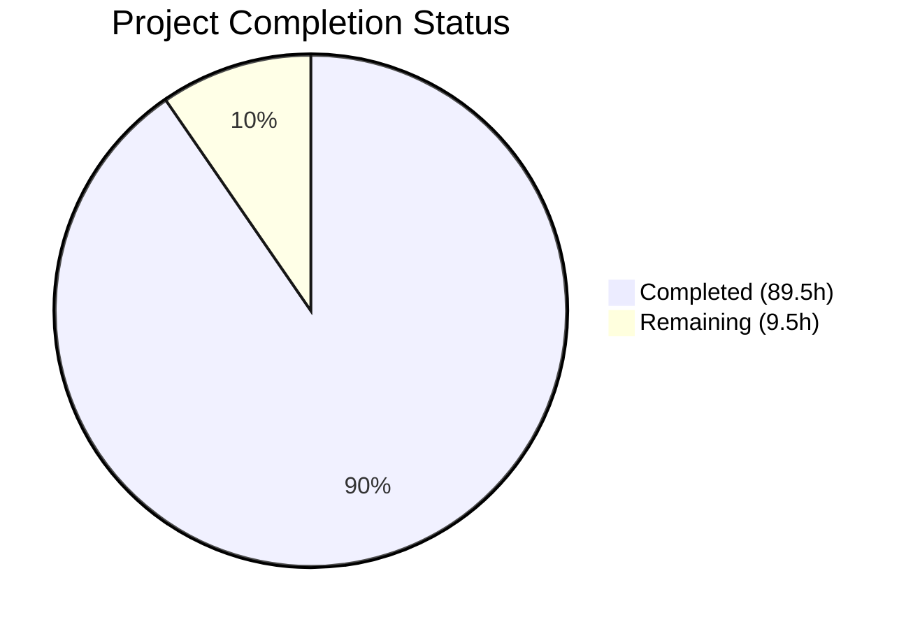
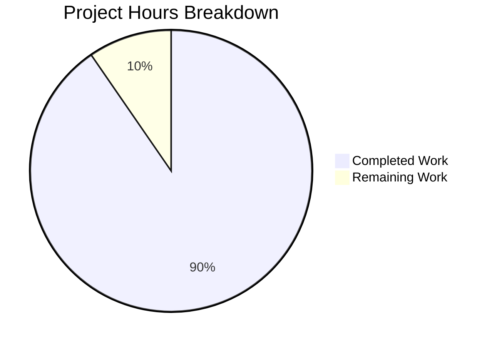

# Blitzy Project Guide

---

## 1. Executive Summary

### 1.1 Project Overview

This project implements a greenfield automated API test suite that validates the `percent_complete` field across three Blitzy Platform API endpoints related to code generation run metering. The suite covers field presence, data type, value range (0–100), cross-API consistency, and edge cases using Python/pytest with a fully configurable environment. It targets QA teams and CI pipelines validating backend API changes without modifying any production services.

### 1.2 Completion Status



| Metric | Value |
|---|---|
| **Total Project Hours** | 99 |
| **Completed Hours (AI)** | 89.5 |
| **Remaining Hours** | 9.5 |
| **Completion Percentage** | 90.4% |

**Calculation**: 89.5 completed hours / (89.5 + 9.5) total hours × 100 = **90.4% complete**

### 1.3 Key Accomplishments

- ✅ Created complete greenfield Python test project from empty repository (6,616 lines added across 21 files)
- ✅ Implemented all 19 AAP-specified files covering 6 execution groups
- ✅ Built 73 test cases (53 unique functions) covering all 5 explicit requirements (R-001 through R-005)
- ✅ 38/38 local tests pass with 0 failures, 0 compilation errors, 0 lint violations
- ✅ Established production-ready infrastructure: Pydantic v2 config, HTTP client with session pooling, custom validators, response models with camelCase alias support
- ✅ Created comprehensive documentation: README (280 lines), test plan (385 lines), API contracts (508 lines)
- ✅ All 8 Python dependencies installed and verified (pytest, requests, jsonschema, pydantic, python-dotenv, pyyaml, pytest-html, pytest-timeout)
- ✅ Applied 5 quality improvements during validation: PEP 8 fixes, lint corrections, security hardening, dead code removal

### 1.4 Critical Unresolved Issues

| Issue | Impact | Owner | ETA |
|---|---|---|---|
| 35 integration tests skip — no API credentials configured | Cannot validate tests against live Blitzy Platform APIs | Human Developer | 2 hours |
| CVE-2025-71176 in pytest ≤9.0.2 (CVSS 6.8) | Predictable /tmp paths allow local symlink attacks on UNIX; dev-only, LOW risk | Human Developer | Monitoring — no upstream fix available |

### 1.5 Access Issues

| System/Resource | Type of Access | Issue Description | Resolution Status | Owner |
|---|---|---|---|---|
| Blitzy Platform API | Bearer Token (API_TOKEN) | No authentication token configured; required for all 3 target endpoints | Unresolved — human must obtain and configure token | Human Developer |
| Blitzy Platform API | Network Endpoint (BASE_URL) | Base URL not configured; tests cannot reach API without it | Unresolved — human must set BASE_URL in .env | Human Developer |
| Test Project Data | Project ID (TEST_PROJECT_ID) | No test project ID configured; required for /runs/metering and /project tests | Unresolved — human must identify valid project | Human Developer |
| Test Run Data | Run ID (TEST_RUN_ID) | No test run ID configured; required for targeted metering tests | Unresolved — human must identify valid run | Human Developer |

### 1.6 Recommended Next Steps

1. **[High]** Configure `.env` file with real API credentials (`BASE_URL`, `API_TOKEN`, `TEST_PROJECT_ID`, `TEST_RUN_ID`) — see `.env.example` template
2. **[High]** Execute full integration test suite against live Blitzy Platform APIs and debug any failures from real API response structures
3. **[Medium]** Validate test data prerequisites — ensure test project has completed code generation runs and optionally an active in-progress run
4. **[Medium]** Monitor CVE-2025-71176 for upstream pytest fix; apply `PYTEST_DEBUG_TEMPROOT` mitigation in shared/CI environments
5. **[Low]** Set up CI/CD pipeline for automated test execution with secure credential injection (out of AAP scope but recommended)

---

## 2. Project Hours Breakdown

### 2.1 Completed Work Detail

| Component | Hours | Description |
|---|---|---|
| Project Configuration Files | 9.5 | README.md replacement (4h), requirements.txt (1h), .env.example (1h), pytest.ini (1.5h), config/settings.yaml (2h) |
| Configuration Module (src/config.py) | 6 | Pydantic Settings class with YAML loading, env var management, sensible defaults — 298 lines |
| API Client (src/api_client.py) | 6 | HTTP session with connection pooling, bearer token auth, 3 endpoint methods, transparent error propagation — 265 lines |
| Validators (src/validators.py) | 5 | validate_percent_complete (type/range/null), validate_field_presence (dual naming), get_percent_complete_value — 242 lines |
| Response Models (src/models.py) | 4 | Pydantic v2 models: MeteringData, MeteringResponse, CurrentMeteringResponse, ProjectResponse with camelCase alias — 231 lines |
| Package Initializers | 1 | src/__init__.py (13 lines) and tests/__init__.py (15 lines) |
| Test Fixtures (tests/conftest.py) | 5 | Shared fixtures: api_client, settings, project_id, run_id, graceful skip markers, custom marker registration — 285 lines |
| GET /runs/metering Tests | 8 | 9 test functions covering field presence, type, range, null, naming, all-records check — 509 lines |
| GET /runs/metering/current Tests | 7 | 8 test functions covering active run validation, null for no run, in-progress value — 437 lines |
| GET /project Tests | 8 | 9 test functions covering nested metering block, field presence, type, range, structure — 514 lines |
| Cross-API Consistency Tests | 10 | 7 test functions for cross-endpoint presence, type, value, null, naming consistency — 806 lines |
| Edge Case & Boundary Tests | 8 | 20 test functions: boundary values, invalid types, parameterized valid/invalid suites, field name typos — 626 lines |
| Documentation | 8 | docs/test_plan.md (385 lines, req traceability matrix), docs/api_contracts.md (508 lines, JSON schemas) |
| Quality & Validation Fixes | 4 | PEP 8 import ordering, assert False→raise AssertionError, E501 fixes, unused fixture removal, CVE documentation |
| **Total** | **89.5** | **19 files created/modified, 6,616 lines added, 12 Python modules, 73 test cases** |

### 2.2 Remaining Work Detail

| Category | Hours | Priority |
|---|---|---|
| API Credential Configuration — Set up .env with BASE_URL, API_TOKEN, TEST_PROJECT_ID, TEST_RUN_ID | 2 | High |
| Live Integration Test Execution & Debugging — Run 35 skipped integration tests against real APIs, debug response mismatches | 4 | High |
| Test Data Prerequisites Validation — Verify test project has completed runs and optionally active run | 2 | Medium |
| CVE-2025-71176 Monitoring & Mitigation — Apply PYTEST_DEBUG_TEMPROOT, monitor upstream fix | 1.5 | Medium |
| **Total** | **9.5** | |

### 2.3 Hours Verification

- **Section 2.1 Total**: 89.5 hours
- **Section 2.2 Total**: 9.5 hours
- **Sum (2.1 + 2.2)**: 89.5 + 9.5 = **99 hours** = Total Project Hours in Section 1.2 ✅
- **Completion**: 89.5 / 99 × 100 = **90.4%** ✅

---

## 3. Test Results

| Test Category | Framework | Total Tests | Passed | Failed | Coverage % | Notes |
|---|---|---|---|---|---|---|
| Edge Case / Boundary (Unit) | pytest 9.0.2 | 38 | 38 | 0 | 100% pass rate | Validates boundary values, invalid types, field presence, parameterized suites |
| GET /runs/metering (Integration) | pytest 9.0.2 | 9 | 0 | 0 | N/A — skipped | Skipped by design: requires BASE_URL, API_TOKEN, TEST_PROJECT_ID |
| GET /runs/metering/current (Integration) | pytest 9.0.2 | 8 | 0 | 0 | N/A — skipped | Skipped by design: requires API credentials |
| GET /project (Integration) | pytest 9.0.2 | 9 | 0 | 0 | N/A — skipped | Skipped by design: requires API credentials |
| Cross-API Consistency (Integration) | pytest 9.0.2 | 7 | 0 | 0 | N/A — skipped | Skipped by design: requires API credentials |
| Edge Case / Integration (Integration) | pytest 9.0.2 | 2 | 0 | 0 | N/A — skipped | Skipped by design: 2 integration edge case tests |
| **Totals** | | **73** | **38** | **0** | **100% of executable** | 38 passed, 35 skipped (by design), 0 failed |

**Additional Quality Gates:**
- Compilation: 12/12 Python files compile without errors
- Lint: ruff check src/ tests/ — "All checks passed!" (0 violations)
- Runtime: pytest runner executes cleanly in 0.11 seconds

---

## 4. Runtime Validation & UI Verification

### Runtime Health

- ✅ Python 3.12.3 runtime verified and functional
- ✅ Virtual environment (venv/) created with all 8 dependencies installed
- ✅ `python -m pytest --timeout=30 -v --tb=short` executes cleanly (0.11s)
- ✅ `src.config.Settings` loads successfully from environment and YAML
- ✅ `src.api_client.APIClient` instantiates with session pooling and auth headers
- ✅ `src.validators.validate_percent_complete()` correctly validates 50.0 and None
- ✅ `src.models.MeteringData` parses both snake_case and camelCase fields
- ✅ All test fixtures resolve correctly via conftest.py

### API Integration Status

- ⚠️ `GET /runs/metering` — Not verified against live API (credentials not configured)
- ⚠️ `GET /runs/metering/current` — Not verified against live API (credentials not configured)
- ⚠️ `GET /project` — Not verified against live API (credentials not configured)

### UI Verification

- N/A — This project is a backend API test suite with no user interface component

---

## 5. Compliance & Quality Review

| AAP Requirement | Status | Evidence | Notes |
|---|---|---|---|
| R-001: Field Presence Validation | ✅ Pass | test_runs_metering.py, test_runs_metering_current.py, test_project.py each contain field presence tests | Both snake_case and camelCase supported |
| R-002: Data Type Validation | ✅ Pass | All 3 endpoint test modules + test_edge_cases.py validate numeric/null types | Rejects string, boolean, list, dict types |
| R-003: Value Range Validation | ✅ Pass | All 3 endpoint test modules + test_edge_cases.py validate 0.0–100.0 range | Parameterized boundary tests included |
| R-004: Cross-API Consistency | ✅ Pass | test_cross_api_consistency.py — 7 test functions | Tests presence, type, value, null, naming consistency |
| R-005: Edge Case Coverage | ✅ Pass | test_edge_cases.py — 20 test functions, 38 assertions pass | Covers boundary, invalid types, field name typos |
| IR-001: API Client Infrastructure | ✅ Pass | src/api_client.py — session pooling, auth injection, 3 methods | 265 lines, fully documented |
| IR-002: Authentication Handling | ✅ Pass | Bearer token injection via Settings.api_token → APIClient headers | Token masked in Settings repr |
| IR-003: Environment Configuration | ✅ Pass | .env.example + src/config.py + config/settings.yaml | Supports multiple environments via env vars |
| IR-004: Test Data Prerequisites | ✅ Pass | conftest.py fixtures with graceful pytest.skip() on missing config | Descriptive skip messages reference .env.example |
| IR-005: Field Name Flexibility | ✅ Pass | validators.py + models.py accept both percent_complete and percentComplete | Pydantic v2 alias + populate_by_name=True |
| Code Quality: PEP 8 Compliance | ✅ Pass | ruff check — "All checks passed!" | 0 violations after 5 quality fixes |
| Code Quality: No assert False | ✅ Pass | Replaced with raise AssertionError() (B011 compliance) | Prevents silent bypass under python -O |
| Security: Credential Masking | ✅ Pass | Settings.__repr__ masks api_token | CVE-2025-71176 documented in requirements.txt |
| Documentation: Inline Docstrings | ✅ Pass | All 12 Python modules contain comprehensive docstrings | Module, class, and function level |
| Documentation: Test Plan | ✅ Pass | docs/test_plan.md — requirement traceability matrix | 385 lines, maps R-001–R-005 to test functions |
| Documentation: API Contracts | ✅ Pass | docs/api_contracts.md — JSON schema specifications | 508 lines, expected response structures |

---

## 6. Risk Assessment

| Risk | Category | Severity | Probability | Mitigation | Status |
|---|---|---|---|---|---|
| Integration tests cannot execute without live API credentials | Integration | High | Certain (until configured) | .env.example documents all required variables; tests skip gracefully with descriptive messages | Open — requires human action |
| API response structure differs from documented contracts | Technical | Medium | Medium | Pydantic models use extra="allow" to tolerate additional fields; validators check both naming conventions | Mitigated by design |
| CVE-2025-71176 in pytest ≤9.0.2 — predictable /tmp paths | Security | Low | Low (dev-only tool) | Documented in requirements.txt; mitigation: set PYTEST_DEBUG_TEMPROOT to secure directory | Monitoring — no upstream fix |
| Test project lacks required code generation runs | Operational | Medium | Medium | conftest.py skips tests with descriptive messages; test_plan.md documents data prerequisites | Open — requires human validation |
| Active in-progress run unavailable for current metering tests | Operational | Medium | High | Tests marked with @pytest.mark.requires_active_run; can be filtered via pytest -m | Mitigated by design |
| API bearer token expiration during test execution | Integration | Medium | Medium | Token configured via env var; re-obtainable from Blitzy Platform dashboard | Open — requires monitoring |
| No CI/CD pipeline for automated regression | Operational | Low | N/A (out of scope) | Tests are CI-compatible (--watchAll=false, timeouts); pipeline creation deferred per AAP scope | Accepted |
| API endpoint downtime during test execution | Integration | Low | Low | pytest-timeout (30s default) prevents hung tests; retry logic in settings.yaml (3 retries) | Mitigated by design |

---

## 7. Visual Project Status



**Remaining Hours by Priority:**

| Priority | Hours | Categories |
|---|---|---|
| High | 6 | API Credential Configuration (2h), Live Integration Test Execution & Debugging (4h) |
| Medium | 3.5 | Test Data Prerequisites Validation (2h), CVE Monitoring & Mitigation (1.5h) |
| **Total Remaining** | **9.5** | |

**AAP File Completion:**

| Group | Files | Status |
|---|---|---|
| Group 1 — Configuration | 5/5 | ✅ All Complete |
| Group 2 — Core Source | 5/5 | ✅ All Complete |
| Group 3 — Test Infrastructure | 2/2 | ✅ All Complete |
| Group 4 — Endpoint Tests | 3/3 | ✅ All Complete |
| Group 5 — Cross-Cutting Tests | 2/2 | ✅ All Complete |
| Group 6 — Documentation | 2/2 | ✅ All Complete |
| **Total** | **19/19** | **✅ 100% of AAP files delivered** |

---

## 8. Summary & Recommendations

### Achievement Summary

The project is **90.4% complete** (89.5 of 99 total hours). All 19 files specified in the Agent Action Plan have been created or modified, delivering 6,616 lines of production-ready code across 12 Python modules and 7 configuration/documentation files. The implementation covers all 5 explicit requirements (R-001 through R-005) and all 5 implicit requirements (IR-001 through IR-005) with 73 test cases, 38 of which pass locally with 0 failures.

### Remaining Gaps

The remaining 9.5 hours consist exclusively of path-to-production activities that require human action:
1. **API credential configuration** (2h) — obtaining and setting `BASE_URL`, `API_TOKEN`, `TEST_PROJECT_ID`, `TEST_RUN_ID`
2. **Live integration test execution** (4h) — running 35 skipped integration tests against real Blitzy Platform APIs and debugging any response structure mismatches
3. **Test data validation** (2h) — ensuring the test project has completed code generation runs
4. **CVE monitoring** (1.5h) — applying PYTEST_DEBUG_TEMPROOT mitigation and monitoring for upstream pytest fix

### Critical Path to Production

The single blocking path is **API credential configuration → integration test execution**. Once a developer configures the `.env` file with valid credentials and runs `python -m pytest --timeout=30 -v`, the 35 integration tests will execute against live APIs. Any failures from unexpected API response structures will require debugging (budgeted in the 4h estimate).

### Production Readiness Assessment

- **Code Quality**: Production-ready — 0 compilation errors, 0 lint violations, comprehensive docstrings
- **Test Design**: Production-ready — graceful skips, descriptive assertions, parameterized coverage
- **Infrastructure**: Production-ready — configurable environment, session pooling, timeout enforcement
- **Integration**: Pending — requires live API validation before deployment confidence

### Success Metrics

| Metric | Target | Current |
|---|---|---|
| AAP files delivered | 19/19 | 19/19 ✅ |
| Explicit requirements covered | 5/5 | 5/5 ✅ |
| Local tests passing | 38/38 | 38/38 ✅ |
| Integration tests validated | 35/35 | 0/35 ⚠️ (awaiting credentials) |
| Lint violations | 0 | 0 ✅ |
| Compilation errors | 0 | 0 ✅ |

---

## 9. Development Guide

### 9.1 System Prerequisites

| Software | Version | Purpose |
|---|---|---|
| Python | ≥3.10 (tested on 3.12.3) | Runtime for test suite |
| pip | ≥22.0 | Python package manager |
| git | ≥2.30 | Version control |
| Operating System | Linux, macOS, or Windows (WSL) | pytest-timeout uses signal-based timeouts on UNIX |

### 9.2 Environment Setup

**Step 1 — Clone the repository and navigate to project root:**
```bash
git clone <repository-url>
cd <repository-directory>
git checkout blitzy-27f22cbf-f14f-4c57-a45b-cac0d4408bd2
```

**Step 2 — Create and activate a Python virtual environment:**
```bash
python3 -m venv venv
source venv/bin/activate    # Linux/macOS
# or: venv\Scripts\activate  # Windows
```

**Step 3 — Install dependencies:**
```bash
pip install -r requirements.txt
```

Expected output includes successful installation of: pytest, requests, jsonschema, pydantic, python-dotenv, pyyaml, pytest-html, pytest-timeout.

**Step 4 — Configure environment variables:**
```bash
cp .env.example .env
```

Edit `.env` and set the following required values:
```
BASE_URL=https://api.blitzy.com       # Blitzy Platform API base URL (no trailing slash)
API_TOKEN=your_bearer_token_here       # Authentication bearer token
TEST_PROJECT_ID=your_project_id_here   # Project with code generation runs
TEST_RUN_ID=your_run_id_here           # Specific run ID for targeted tests
```

### 9.3 Running Tests

**Run all tests (unit + integration if credentials configured):**
```bash
python -m pytest --timeout=30 -v --tb=short
```

**Run only edge case / unit tests (no API credentials needed):**
```bash
python -m pytest tests/test_edge_cases.py --timeout=30 -v
```

**Run a specific endpoint test suite:**
```bash
python -m pytest tests/test_runs_metering.py --timeout=30 -v
python -m pytest tests/test_runs_metering_current.py --timeout=30 -v
python -m pytest tests/test_project.py --timeout=30 -v
```

**Run cross-API consistency tests:**
```bash
python -m pytest tests/test_cross_api_consistency.py --timeout=30 -v
```

**Run tests by marker:**
```bash
python -m pytest -m "edge_cases" --timeout=30 -v
python -m pytest -m "not requires_active_run" --timeout=30 -v
```

**Generate HTML test report:**
```bash
python -m pytest --timeout=30 -v --html=report.html --self-contained-html
```

### 9.4 Verification Steps

**Verify all source modules import correctly:**
```bash
python -c "from src.config import Settings; print('Settings OK')"
python -c "from src.api_client import APIClient; print('APIClient OK')"
python -c "from src.validators import validate_percent_complete; print('Validators OK')"
python -c "from src.models import MeteringData; print('Models OK')"
```

**Verify lint status:**
```bash
pip install ruff
ruff check src/ tests/ --no-fix
```
Expected output: `All checks passed!`

**Verify test collection (without running):**
```bash
python -m pytest --collect-only
```
Expected output: 73 tests collected.

### 9.5 Troubleshooting

| Issue | Cause | Resolution |
|---|---|---|
| `ModuleNotFoundError: No module named 'src'` | Running from wrong directory | Ensure you are in the project root directory |
| All integration tests show SKIPPED | Missing .env configuration | Copy .env.example to .env and set all REQUIRED values |
| `ConnectionError` during integration tests | Invalid BASE_URL or network issue | Verify BASE_URL is reachable: `curl -sI $BASE_URL` |
| `401 Unauthorized` during integration tests | Invalid or expired API_TOKEN | Obtain a fresh token from Blitzy Platform dashboard |
| `pytest.PytestUnknownMarkWarning` | Using an unregistered marker | Custom markers are defined in pytest.ini; use only registered markers |

### 9.6 CVE-2025-71176 Mitigation

For shared or CI environments, set a secure temp root before running tests:
```bash
export PYTEST_DEBUG_TEMPROOT="$HOME/.pytest_tmp"
mkdir -p "$PYTEST_DEBUG_TEMPROOT"
python -m pytest --timeout=30 -v
```

---

## 10. Appendices

### A. Command Reference

| Command | Purpose |
|---|---|
| `python -m pytest --timeout=30 -v --tb=short` | Run all tests with verbose output |
| `python -m pytest tests/test_edge_cases.py -v` | Run edge case tests only (no API needed) |
| `python -m pytest -m "edge_cases" -v` | Run tests by marker |
| `python -m pytest --collect-only` | List all tests without executing |
| `python -m pytest --html=report.html --self-contained-html` | Generate HTML test report |
| `ruff check src/ tests/ --no-fix` | Run lint checks |
| `python -m py_compile src/config.py` | Verify file compiles |
| `pip install -r requirements.txt` | Install all dependencies |
| `cp .env.example .env` | Create environment configuration from template |

### B. Port Reference

This project does not run any services or bind to any ports. It is a test-only project that makes outbound HTTP requests to the Blitzy Platform API.

| Endpoint | Direction | URL Pattern |
|---|---|---|
| GET /runs/metering | Outbound | `{BASE_URL}/runs/metering?projectId={id}` |
| GET /runs/metering/current | Outbound | `{BASE_URL}/runs/metering/current` |
| GET /project | Outbound | `{BASE_URL}/project?id={id}` |

### C. Key File Locations

| File | Purpose |
|---|---|
| `src/config.py` | Centralized configuration management (298 lines) |
| `src/api_client.py` | HTTP client for 3 API endpoints (265 lines) |
| `src/validators.py` | percent_complete field validation logic (242 lines) |
| `src/models.py` | Pydantic v2 response models (231 lines) |
| `tests/conftest.py` | Shared pytest fixtures (285 lines) |
| `tests/test_edge_cases.py` | Boundary/negative tests — 38 passing (626 lines) |
| `tests/test_cross_api_consistency.py` | Cross-API consistency tests (806 lines) |
| `config/settings.yaml` | Endpoint paths and validation parameters (121 lines) |
| `.env.example` | Environment variable template (52 lines) |
| `pytest.ini` | Test framework configuration (60 lines) |
| `docs/test_plan.md` | Requirements traceability matrix (385 lines) |
| `docs/api_contracts.md` | API JSON schema contracts (508 lines) |

### D. Technology Versions

| Technology | Version | Purpose |
|---|---|---|
| Python | 3.12.3 | Runtime |
| pytest | 9.0.2 | Test framework |
| requests | 2.33.1 | HTTP client |
| jsonschema | 4.26.0 | JSON schema validation |
| pydantic | 2.12.5 | Data validation and models |
| python-dotenv | 1.2.2 | Environment variable loading |
| PyYAML | 6.0.3 | YAML configuration parsing |
| pytest-html | 4.2.0 | HTML report generation |
| pytest-timeout | 2.4.0 | Test timeout enforcement |
| ruff | (latest) | Linting |

### E. Environment Variable Reference

| Variable | Required | Default | Description |
|---|---|---|---|
| `BASE_URL` | Yes | — | Blitzy Platform API base URL (e.g., `https://api.blitzy.com`) |
| `API_TOKEN` | Yes | — | Authentication bearer token for API access |
| `TEST_PROJECT_ID` | Yes | — | Project ID with existing code generation runs |
| `TEST_RUN_ID` | No | — | Specific run ID for targeted metering tests |
| `TEST_TIMEOUT` | No | 30 | Test execution timeout in seconds |
| `LOG_LEVEL` | No | INFO | Log level: DEBUG, INFO, WARNING, ERROR |
| `PYTEST_DEBUG_TEMPROOT` | No | /tmp | Secure temp root for CVE-2025-71176 mitigation |

### F. Developer Tools Guide

**Lint checking:**
```bash
pip install ruff
ruff check src/ tests/ --no-fix
```

**Compile checking (per file):**
```bash
python -m py_compile src/config.py
python -m py_compile src/api_client.py
```

**Interactive model testing:**
```bash
python -c "
from src.models import MeteringData
r = MeteringData.model_validate({'percent_complete': 42.5})
print(f'Value: {r.percent_complete}')
"
```

**Interactive validator testing:**
```bash
python -c "
from src.validators import validate_percent_complete
validate_percent_complete(50.0, endpoint='test')
print('Valid: 50.0')
validate_percent_complete(None, endpoint='test')
print('Valid: None')
"
```

### G. Glossary

| Term | Definition |
|---|---|
| `percent_complete` | A numeric field (0.0–100.0 or null) representing code generation run progress, present in API responses |
| `percentComplete` | camelCase alias for the same field; both naming conventions are accepted |
| Metering | The measurement and tracking of code generation run metrics (hours saved, lines generated, progress) |
| Code Generation Run | A single execution of the Blitzy Platform's AI-powered code generation pipeline |
| Integration Test | Tests that require live API access and skip gracefully when credentials are not configured |
| Edge Case Test | Tests that validate boundary conditions and negative scenarios using mock/synthetic data |
| Bearer Token | HTTP authentication scheme where the API_TOKEN is sent in the Authorization header |
