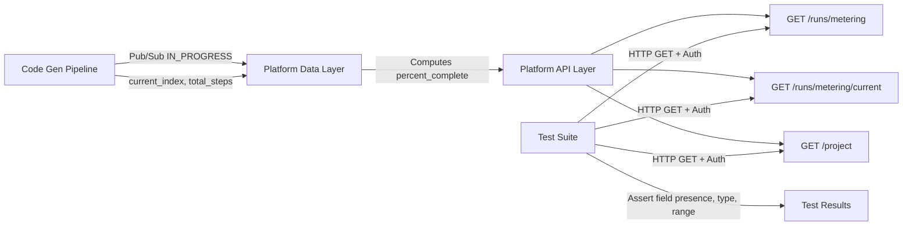

# Technical Specification

# 0. Agent Action Plan

## 0.1 Intent Clarification

### 0.1.1 Core Feature Objective

Based on the prompt, the Blitzy platform understands that the new feature requirement is to **add automated API response test coverage** that verifies the presence, type, and value constraints of a newly introduced `percent_complete` (or `percentComplete`) field across three existing Blitzy Platform API endpoints related to code generation run metering and project data.

The specific feature requirements are:

- **Requirement R-001 — Field Presence Validation**: Verify that the `percent_complete` or `percentComplete` field is present in the JSON response payload of all three target API endpoints: `GET /runs/metering`, `GET /runs/metering/current`, and `GET /project` (with inline metering data)
- **Requirement R-002 — Data Type Validation**: Confirm that the field value is either a numeric type (`float` or `int`) or explicitly `null` — never a string, boolean, or other non-numeric type
- **Requirement R-003 — Value Range Validation**: Assert that when the field value is not `null`, it falls within the inclusive range of `0.0` to `100.0`
- **Requirement R-004 — Cross-API Consistency**: Ensure the field is consistently present across all three APIs — if present in one API but missing in another, flag this as a defect
- **Requirement R-005 — Edge Case Coverage**: Validate negative scenarios including values exceeding 100, values below 0, wrong data types, and field name mismatches between `percent_complete` and `percentComplete`

Implicit requirements detected:

- **IR-001 — API Client Infrastructure**: Since the repository is currently empty (greenfield), a complete HTTP client and test execution framework must be established from scratch
- **IR-002 — Authentication Handling**: The Blitzy Platform APIs likely require authentication (bearer tokens or API keys) which the test infrastructure must support
- **IR-003 — Environment Configuration**: Tests must support multiple deployment environments (development, staging) via configurable base URLs
- **IR-004 — Test Data Prerequisites**: Tests require existing project IDs and active code generation runs to trigger the target API responses
- **IR-005 — Field Name Flexibility**: The tests must account for both `percent_complete` (snake_case) and `percentComplete` (camelCase) naming conventions, as the exact naming may vary per API endpoint

### 0.1.2 Special Instructions and Constraints

- **Scope Constraint**: This feature is specifically scoped to code generation project runs — the `percent_complete` field is expected only in the context of code generation metering, not general platform operations
- **API Context**: These are existing platform APIs that have been recently extended to include the new field — the tests verify a backend change, not a new endpoint
- **Trigger Awareness**: The APIs are not always called automatically; specific user actions (opening a project, starting a run, refreshing the dashboard) trigger these calls — tests must account for this by ensuring appropriate preconditions
- **Network Inspection Guidance**: The user provided detailed browser DevTools network tab inspection instructions, indicating these tests bridge both automated API testing and manual QA verification workflows

User Example — Expected API Response Patterns:
```
GET /runs/metering?projectId=xxx → includes percent_complete field
GET /runs/metering/current → includes percent_complete field (live run)
GET /project?id=xxx → includes inline metering with percent_complete
```

User Example — Validation Matrix:
| Scenario | Expected |
|---|---|
| Completed run | Value between 0–100 |
| In-progress run | Likely less than 100 |
| No data | `null` |
| Field missing | Bug — test failure |

### 0.1.3 Technical Interpretation

These feature requirements translate to the following technical implementation strategy:

- To **establish the test infrastructure**, we will create a Python-based test project using `pytest` as the test framework and the `requests` library as the HTTP client, with `jsonschema` for response schema validation
- To **validate field presence across all three APIs**, we will create parameterized test functions that invoke each endpoint and assert the existence of the `percent_complete`/`percentComplete` key in the response JSON
- To **enforce value range constraints**, we will implement custom assertion helpers that verify numeric type and `0.0 ≤ value ≤ 100.0` range, with explicit `null` acceptance
- To **test edge cases and negative scenarios**, we will create dedicated test modules that validate boundary conditions (exactly 0, exactly 100), invalid states (greater than 100, less than 0, wrong types), and cross-API consistency
- To **support multiple environments**, we will implement a configuration layer using environment variables and pytest fixtures that inject configurable base URLs, authentication credentials, and project identifiers
- To **document test procedures**, we will create comprehensive README documentation and inline docstrings that mirror the user's manual DevTools inspection workflow for QA team reference

## 0.2 Repository Scope Discovery

### 0.2.1 Comprehensive File Analysis

**Current Repository State**: The repository is a **greenfield project** containing only a single file:

| File | Status | Content |
|---|---|---|
| `README.md` | UNCHANGED | Contains only `# 6thaprilone` — a placeholder heading with no project documentation |

No existing source code, test files, configuration files, dependency manifests, build scripts, or CI/CD pipelines exist. The entire test infrastructure must be created from scratch.

**Architectural Context from Tech Spec**: The broader Blitzy Platform system includes the `archie-job-reverse-document-generator` — a headless Cloud Run batch job with consumer-only integration posture. The three target APIs (`GET /runs/metering`, `GET /runs/metering/current`, `GET /project`) belong to the **upstream Blitzy Platform API layer** (likely the Admin Service or frontend-facing API gateway), not the reverse document generator itself. These APIs expose metering and project data that the batch job contributes to via Pub/Sub notifications containing fields like `estimated_hours_saved`, `estimated_lines_generated`, and now `percent_complete`.

**Integration Point Discovery**:

- **API Endpoints Connecting to Feature**:
  - `GET /runs/metering` — Retrieves metering data for multiple runs; includes `percent_complete` per run record; triggered when viewing run history or fetching metering data with query parameter `projectId`
  - `GET /runs/metering/current` — Returns metering data for the currently in-progress run; includes `percent_complete` reflecting live progress; triggered by live run status views and auto-refresh polling
  - `GET /project` — Returns project details with inline metering data embedded; includes `percent_complete` within nested metering object; triggered on project page load with query parameter `id`

- **Data Flow Path**: The `percent_complete` field originates from the code generation pipeline → propagates through Pub/Sub `IN_PROGRESS` notifications → gets stored by the platform's data layer → surfaces through the three target REST APIs

- **No Database Models or Migrations Affected**: This test project does not modify any database schema — it only reads API responses

- **No Service Classes or Middleware Impacted**: This is a standalone test project with no production service modifications

### 0.2.2 Web Search Research Conducted

Research was conducted on the following topics to inform the implementation approach:

- **Best practices for pytest-based API response field validation** — Confirmed that `pytest` with `requests` library is the standard approach for Python API testing, using fixtures for setup and parameterized tests for coverage breadth
- **JSON schema validation for API testing** — Identified `jsonschema` as the standard library for validating API response structures against predefined schemas
- **API test project structure patterns** — Established the standard directory layout: `tests/` for test modules, `conftest.py` for shared fixtures, `config/` for environment settings
- **Edge case testing strategies for numeric API fields** — Confirmed boundary value analysis (0, 100, null) and negative testing (out-of-range, wrong type) as standard validation patterns

### 0.2.3 New File Requirements

**New Source Files to Create**:

- `src/api_client.py` — HTTP client wrapper encapsulating authentication, base URL configuration, and request methods for all three target endpoints
- `src/config.py` — Configuration management module reading environment variables for base URL, API keys, project IDs, and test timeouts
- `src/validators.py` — Custom validation utilities implementing `percent_complete` field presence, type, and range checks with descriptive error messages
- `src/models.py` — Pydantic-based response models defining the expected schema for metering and project API responses, including the `percent_complete` field

**New Test Files to Create**:

- `tests/conftest.py` — Shared pytest fixtures providing API client instances, authentication tokens, test project IDs, and run IDs
- `tests/test_runs_metering.py` — Test suite for `GET /runs/metering` endpoint validating `percent_complete` field presence, type, value range, and edge cases
- `tests/test_runs_metering_current.py` — Test suite for `GET /runs/metering/current` endpoint with identical validation logic plus live-run-specific assertions
- `tests/test_project.py` — Test suite for `GET /project` endpoint validating `percent_complete` within the inline metering data structure
- `tests/test_cross_api_consistency.py` — Cross-cutting test suite verifying that the `percent_complete` field behavior is consistent across all three endpoints
- `tests/test_edge_cases.py` — Dedicated edge case and boundary condition tests covering out-of-range values, null handling, type mismatches, and field name conventions

**New Configuration Files to Create**:

- `pytest.ini` — Pytest configuration defining test discovery patterns, markers, timeout settings, and output formatting
- `requirements.txt` — Project dependency manifest listing all required packages with pinned versions
- `.env.example` — Template environment variable file documenting all required configuration for running the test suite
- `config/settings.yaml` — Feature-specific configuration defining default test parameters, API endpoint paths, and expected field names

**New Documentation Files to Create**:

- `README.md` — Complete project documentation covering purpose, setup, configuration, execution, and manual QA verification reference (replacing the current placeholder)
- `docs/test_plan.md` — Detailed test plan document mapping each requirement to specific test cases with expected outcomes
- `docs/api_contracts.md` — API response contract documentation defining the expected JSON structure for each endpoint including the `percent_complete` field

## 0.3 Dependency Inventory

### 0.3.1 Private and Public Packages

Since the repository is greenfield with no existing dependency manifest, all packages listed below are new additions required to establish the API test infrastructure. Versions have been verified through web search for current stable releases as of April 2026.

| Registry | Package | Version | Purpose |
|---|---|---|---|
| PyPI | `pytest` | `>=8.3.0` | Primary test framework for organizing, discovering, and executing API test cases |
| PyPI | `requests` | `>=2.32.0` | HTTP client library for making GET requests to the three target API endpoints |
| PyPI | `jsonschema` | `>=4.23.0` | JSON schema validation for asserting API response structures match expected contracts |
| PyPI | `pydantic` | `>=2.9.0` | Data validation and response model definition for parsing API responses with type safety |
| PyPI | `python-dotenv` | `>=1.0.0` | Environment variable loading from `.env` files for configurable test execution |
| PyPI | `pytest-html` | `>=4.1.0` | HTML test report generation for QA team review and CI/CD artifact publishing |
| PyPI | `pytest-timeout` | `>=2.3.0` | Test execution timeout enforcement preventing hung tests during API call failures |
| PyPI | `pyyaml` | `>=6.0.0` | YAML configuration file parsing for feature-specific settings |

**Platform Context**: The broader Blitzy Platform uses `blitzy-platform-shared==0.0.731` as its single dependency (housing LangGraph, LangChain, Pydantic, and all transitive libraries). This test project is **independent** of that shared package — it operates as a standalone API test suite that validates the platform's external API responses without importing any platform-internal modules.

### 0.3.2 Dependency Updates

Since this is a greenfield project with no existing dependencies, there are no import transformations or migration updates required. All dependency configuration is net-new.

**Import Structure for New Files**:

- `src/api_client.py` — Requires: `import requests`, `from src.config import Settings`
- `src/config.py` — Requires: `from pydantic import BaseModel`, `from dotenv import load_dotenv`
- `src/validators.py` — Requires: `from jsonschema import validate`
- `src/models.py` — Requires: `from pydantic import BaseModel, Field`
- `tests/conftest.py` — Requires: `import pytest`, `from src.api_client import APIClient`
- `tests/test_*.py` — Requires: `import pytest`, `from src.validators import validate_percent_complete`

**External Reference Configuration**:

- `requirements.txt` — New file listing all packages above with version pins
- `pytest.ini` — New file configuring pytest discovery, markers, and plugins
- `.env.example` — New file documenting required environment variables:
  - `BASE_URL` — Platform API base URL (e.g., `https://api.blitzy.com`)
  - `API_TOKEN` — Authentication bearer token for API access
  - `TEST_PROJECT_ID` — Project ID with existing code generation runs
  - `TEST_RUN_ID` — Specific run ID for targeted metering tests
- `config/settings.yaml` — New file defining endpoint paths and field name expectations

## 0.4 Integration Analysis

### 0.4.1 Existing Code Touchpoints

**Direct Modifications Required**:

- `README.md` — Replace the current placeholder content (`# 6thaprilone`) with comprehensive project documentation including purpose, setup instructions, test execution commands, and manual QA verification reference. This is the only existing file in the repository that requires modification.

No other existing code touchpoints exist because the repository is greenfield. All other files listed below represent new creation points rather than modifications to existing code.

### 0.4.2 Platform API Integration Points

The test suite integrates with three existing Blitzy Platform API endpoints as external dependencies. Understanding how these endpoints relate to the broader platform data flow is critical for designing effective tests.

**API Endpoint 1 — `GET /runs/metering`**:
- **Purpose**: Retrieves metering data for multiple code generation runs associated with a project
- **Query Parameters**: `projectId` (required) — identifies the target project
- **Response Structure**: Array of run metering objects, each expected to contain the `percent_complete` field
- **Trigger Context**: Called when viewing run history or fetching metering data for a project dashboard
- **Data Origin**: The `percent_complete` value originates from the code generation pipeline's progress tracking, propagated through Pub/Sub `IN_PROGRESS` notifications containing `current_index` and `total_steps` fields, which the platform computes into a percentage

**API Endpoint 2 — `GET /runs/metering/current`**:
- **Purpose**: Returns metering data specifically for the currently active (in-progress) code generation run
- **Query Parameters**: Contextual — may require project or run identification
- **Response Structure**: Single metering object for the active run with `percent_complete` reflecting real-time progress
- **Trigger Context**: Invoked during live run status views and auto-refresh polling intervals
- **Data Origin**: Real-time computation from the active run's `current_index / total_steps` ratio, where total_steps corresponds to the document section count (indices 0–8 per tech spec scope)

**API Endpoint 3 — `GET /project`**:
- **Purpose**: Returns comprehensive project details with inline metering data embedded
- **Query Parameters**: `id` (required) — identifies the target project
- **Response Structure**: Project object containing a nested metering block that includes `percent_complete`
- **Trigger Context**: Called on project page load and dashboard refresh
- **Data Origin**: Aggregated from the most recent run's metering data, including `estimated_hours_saved`, `estimated_lines_generated`, and the new `percent_complete`

### 0.4.3 Authentication and Authorization Dependencies

- **Auth Mechanism**: Platform APIs are secured at the platform level (GCP IAM, VPC). Test execution requires valid authentication credentials (bearer token or API key) configured as environment variables
- **Authorization Scope**: Tests must use credentials with sufficient permissions to read project data, run history, and metering metrics
- **No Auth Modifications**: This test project does not modify any authentication or authorization configuration — it consumes existing auth mechanisms as a client

### 0.4.4 Data Flow Diagram



### 0.4.5 Test Precondition Dependencies

Effective test execution depends on the following platform state conditions:

| Precondition | Required For | Fallback Strategy |
|---|---|---|
| Existing project with code generation runs | `GET /runs/metering`, `GET /project` | Use a dedicated test project with seeded run history |
| At least one completed run | Validating value between 0–100 | Verify against historical run data |
| Active in-progress run | `GET /runs/metering/current` | Mark tests requiring live runs with `@pytest.mark.requires_active_run` skip marker |
| Valid authentication credentials | All three endpoints | Fail fast with descriptive error if credentials are missing or expired |
| Network access to platform API | All three endpoints | Tests are integration tests requiring live API access — no offline fallback |

## 0.5 Technical Implementation

### 0.5.1 File-by-File Execution Plan

Every file listed below MUST be created or modified during implementation. Files are organized into execution groups reflecting logical build order.

**Group 1 — Project Foundation and Configuration**:

| Action | File | Purpose |
|---|---|---|
| MODIFY | `README.md` | Replace placeholder with complete project documentation including setup, execution, and QA reference |
| CREATE | `requirements.txt` | Dependency manifest with pinned versions for all required packages |
| CREATE | `.env.example` | Template environment variable file documenting `BASE_URL`, `API_TOKEN`, `TEST_PROJECT_ID`, `TEST_RUN_ID` |
| CREATE | `pytest.ini` | Pytest configuration: test discovery patterns, custom markers, timeout defaults, report output |
| CREATE | `config/settings.yaml` | Endpoint path definitions, field name variants, and validation parameter defaults |

**Group 2 — Core Source Modules**:

| Action | File | Purpose |
|---|---|---|
| CREATE | `src/__init__.py` | Package initializer for the source module |
| CREATE | `src/config.py` | Configuration management using `pydantic.BaseModel` and `python-dotenv` for environment-based settings |
| CREATE | `src/api_client.py` | HTTP client class wrapping `requests` with methods for each of the three target endpoints, authentication header injection, and response parsing |
| CREATE | `src/validators.py` | Validation functions: `validate_percent_complete(value)` checks type, range, and null acceptance; `validate_field_presence(response, field_names)` checks for either naming convention |
| CREATE | `src/models.py` | Pydantic response models: `MeteringResponse`, `CurrentMeteringResponse`, `ProjectResponse` with `percent_complete` field typed as `Optional[float]` constrained to `ge=0.0, le=100.0` |

**Group 3 — Test Infrastructure**:

| Action | File | Purpose |
|---|---|---|
| CREATE | `tests/__init__.py` | Package initializer for test module |
| CREATE | `tests/conftest.py` | Shared fixtures: `api_client` (authenticated client instance), `test_project_id` (from env), `test_run_id` (from env), `base_url` (from env) |

**Group 4 — Endpoint-Specific Test Suites**:

| Action | File | Purpose |
|---|---|---|
| CREATE | `tests/test_runs_metering.py` | Test `GET /runs/metering`: field presence, numeric type, range 0–100, null acceptance, field naming |
| CREATE | `tests/test_runs_metering_current.py` | Test `GET /runs/metering/current`: field presence, live run value less than 100, null for no active run |
| CREATE | `tests/test_project.py` | Test `GET /project`: field presence within nested metering block, type and range validation |

**Group 5 — Cross-Cutting and Edge Case Tests**:

| Action | File | Purpose |
|---|---|---|
| CREATE | `tests/test_cross_api_consistency.py` | Verify `percent_complete` is present in all three endpoints for the same project/run context |
| CREATE | `tests/test_edge_cases.py` | Boundary conditions: exactly 0.0, exactly 100.0, null, negative values, values over 100, wrong types |

**Group 6 — Documentation**:

| Action | File | Purpose |
|---|---|---|
| CREATE | `docs/test_plan.md` | Test plan mapping each requirement (R-001 through R-005) to specific test functions with expected outcomes |
| CREATE | `docs/api_contracts.md` | API response contract documentation with sample JSON structures for each endpoint |

### 0.5.2 Implementation Approach per File

**Phase A — Establish Foundation**: Begin by creating the configuration layer (`config/settings.yaml`, `src/config.py`, `.env.example`) and dependency manifest (`requirements.txt`). This ensures all subsequent modules have a consistent configuration source and all required packages are declared.

**Phase B — Build API Client**: Create `src/api_client.py` as the central HTTP client with three methods — `get_runs_metering(project_id)`, `get_runs_metering_current()`, and `get_project(project_id)`. Each method injects the authentication bearer token, constructs the full URL from base configuration, and returns parsed JSON responses.

**Phase C — Implement Validators and Models**: Create `src/validators.py` with the core validation function:

```python
def validate_percent_complete(value):
    assert value is None or isinstance(value, (int, float))
```

Create `src/models.py` with Pydantic models that enforce the response contract at the parsing layer.

**Phase D — Wire Test Fixtures**: Create `tests/conftest.py` establishing pytest fixtures that provide a configured `APIClient` instance, project ID, and run ID from environment variables. Include conditional skip markers for tests requiring active runs.

**Phase E — Implement Endpoint Tests**: Build each test module (`test_runs_metering.py`, `test_runs_metering_current.py`, `test_project.py`) following the Arrange-Act-Assert pattern:

```python
def test_percent_complete_present(api_client, test_project_id):
    response = api_client.get_runs_metering(test_project_id)
    assert "percent_complete" in response or "percentComplete" in response
```

**Phase F — Add Cross-Cutting and Edge Case Coverage**: Implement consistency tests that call all three endpoints for the same project and compare field presence. Add parameterized edge case tests covering boundary values.

**Phase G — Document**: Update `README.md` with complete project documentation. Create `docs/test_plan.md` and `docs/api_contracts.md` to formalize the test strategy and API contracts.

### 0.5.3 User Interface Design

This feature has no user interface component — it is a backend API test suite. However, the user provided detailed browser DevTools Network Tab inspection guidance that serves as a manual QA verification companion to the automated tests.

Key insights from the user's instructions for documentation purposes:

- **Manual Verification Workflow**: Open DevTools → Network tab → Filter by `metering`, `runs`, or `project` → Click request → Response/Preview → Search for `percent_complete` or `percentComplete`
- **Filter Recommendation**: Use XHR/Fetch filter with Preserve Log enabled to capture API calls across page navigations
- **Trigger Actions**: Open a project, start/view a code generation run, refresh project dashboard, check run progress/details page
- **Validation Criteria**: Field present with numeric value (0–100) for active/completed runs, `null` for no-data scenarios, field missing indicates a bug

These manual procedures will be documented in the project `README.md` and `docs/test_plan.md` as supplementary QA verification steps alongside the automated test suite.

## 0.6 Scope Boundaries

### 0.6.1 Exhaustively In Scope

**All Feature Source Files**:
- `src/**/*.py` — All source modules including API client, configuration, validators, and response models
- `src/__init__.py` — Package initializer
- `src/config.py` — Environment-based configuration management
- `src/api_client.py` — HTTP client for three target endpoints
- `src/validators.py` — Field validation logic for `percent_complete`
- `src/models.py` — Pydantic response models

**All Feature Test Files**:
- `tests/**/*.py` — All test modules covering endpoint-specific, cross-API, and edge case scenarios
- `tests/__init__.py` — Test package initializer
- `tests/conftest.py` — Shared fixtures (API client, project IDs, run IDs, skip markers)
- `tests/test_runs_metering.py` — `GET /runs/metering` validation suite
- `tests/test_runs_metering_current.py` — `GET /runs/metering/current` validation suite
- `tests/test_project.py` — `GET /project` inline metering validation suite
- `tests/test_cross_api_consistency.py` — Cross-endpoint consistency checks
- `tests/test_edge_cases.py` — Boundary value and negative scenario tests

**Configuration Files**:
- `requirements.txt` — Full dependency manifest with pinned versions
- `pytest.ini` — Test framework configuration, custom markers, timeout settings
- `.env.example` — Template for required environment variables (`BASE_URL`, `API_TOKEN`, `TEST_PROJECT_ID`, `TEST_RUN_ID`)
- `config/settings.yaml` — Endpoint paths, field name variants, validation parameters

**Documentation**:
- `README.md` — Project documentation with setup, execution, and manual QA reference (modification of existing file)
- `docs/test_plan.md` — Formal test plan mapping requirements to test cases
- `docs/api_contracts.md` — API response contract specifications with expected JSON structures

**Target API Endpoints Under Test**:
- `GET /runs/metering?projectId={id}` — Field presence, type, range for historical runs
- `GET /runs/metering/current` — Field presence, type, range for active runs
- `GET /project?id={id}` — Field presence within nested metering block

### 0.6.2 Explicitly Out of Scope

- **Modifying the Blitzy Platform APIs themselves** — This project only tests the responses; it does not implement the `percent_complete` field in the backend services
- **The `archie-job-reverse-document-generator` batch job** — The headless Cloud Run Job and its LangGraph pipeline are not modified or tested by this project
- **Pub/Sub notification payloads** — While `percent_complete` data originates from Pub/Sub `IN_PROGRESS` notifications, testing the message format or publishing logic is outside scope
- **Database schema changes** — No database models, migrations, or storage modifications are included
- **Authentication and authorization implementation** — This project consumes existing auth mechanisms as a client; it does not implement, modify, or test the auth system itself
- **Performance testing** — Load testing, stress testing, or response time benchmarking of the target APIs is not included
- **UI or frontend testing** — No browser automation, Selenium, Playwright, or frontend component testing; the DevTools Network Tab guidance is for manual QA reference only
- **Other API endpoints** — Only the three specified endpoints are tested; no other Blitzy Platform APIs are in scope
- **CI/CD pipeline creation** — While tests are designed to be CI-compatible, creating GitHub Actions workflows or deployment pipelines is not included in this initial scope
- **Refactoring unrelated platform code** — No modifications to existing platform services, models, or infrastructure outside the three target API responses

## 0.7 Rules for Feature Addition

### 0.7.1 Feature-Specific Rules and Requirements

The following rules govern the implementation of this API test suite, derived from the user's explicit instructions and implicit platform conventions:

**Field Naming Convention Rule**: Tests MUST check for both `percent_complete` (snake_case) and `percentComplete` (camelCase) field names. The test validation logic must accept either convention as valid, since different API endpoints or serialization layers may use different naming. If one endpoint uses snake_case and another uses camelCase, this is NOT a bug — both are acceptable. However, if the field is completely absent under both names, that IS a bug.

**Value Constraint Rules**:
- A numeric value between `0.0` and `100.0` inclusive is VALID
- A `null` value is VALID (represents "not applicable" or "no data" scenarios)
- A value greater than `100.0` is INVALID — test must fail
- A value less than `0.0` is INVALID — test must fail
- A non-numeric type (string, boolean, object, array) is INVALID — test must fail
- An integer value within range (e.g., `50`) is VALID — the field accepts both int and float

**Test Isolation Rule**: Each test function must be independently executable without depending on the execution order of other tests. Shared state must flow exclusively through pytest fixtures, not module-level globals or side effects.

**Environment Configuration Rule**: All environment-specific values (base URLs, tokens, project IDs) MUST be read from environment variables or `.env` files — never hardcoded in test files or source modules. Tests must fail gracefully with descriptive skip messages when required configuration is missing.

**Assertion Specificity Rule**: Every assertion must include a descriptive failure message that identifies which API endpoint failed, what field was being validated, and what the actual versus expected value was. Generic assertions like `assert True` are prohibited.

**Code Generation Run Context Rule**: The `percent_complete` field is specifically for code generation project runs. Tests must ensure they are operating against projects and runs that are code generation contexts, not other platform operations that may share similar API structures.

**Cross-API Consistency Rule**: When testing the same project/run across multiple endpoints, the `percent_complete` value should be logically consistent — a completed run should not show `percent_complete < 100` in one endpoint and `100` in another (accounting for timing differences in eventual consistency).

## 0.8 References

### 0.8.1 Codebase Files and Folders Searched

The following files and folders were systematically searched across the repository to derive the conclusions presented in this Agent Action Plan:

| Path | Type | Outcome |
|---|---|---|
| `` (repository root) | Folder | Retrieved via `get_source_folder_contents` — contains only `README.md` (UNCHANGED status), confirming greenfield project state |
| `README.md` | File | Retrieved via `read_file` — contains only `# 6thaprilone` placeholder heading, no project documentation |
| `/` (filesystem root) | Search | Searched via `find / -name ".blitzyignore"` — no `.blitzyignore` files found anywhere in the filesystem |
| `/tmp/environments_files/` | Directory | Checked for user-provided environment files — directory does not exist |

### 0.8.2 Technical Specification Sections Retrieved

The following tech spec sections were retrieved to establish comprehensive system context:

| Section | Key Information Extracted |
|---|---|
| 1.1 Executive Summary | System identity (`archie-job-reverse-document-generator`), Cloud Run Job architecture, Pub/Sub trigger model, AI-powered document generation purpose |
| 1.2 System Overview | 8-node LangGraph pipeline, two-agent architecture (Search + Author), Claude Opus 4 as primary LLM, 350K token context window |
| 1.3 Scope | 9 document sections (indices 0–8), integration with 12+ external services, explicit out-of-scope boundaries (no UI, no auth, no code generation) |
| 2.1 Feature Catalog | 17 features across 5 categories, F-007 (Real-Time Progress Streaming with `current_index`, `total_steps`), F-010 (Metering Estimation with `estimated_hours_saved`, `estimated_lines_generated`) — establishing the data origin for `percent_complete` |
| 3.2 Frameworks and Libraries | Core: LangGraph, LangChain Core, Pydantic (all via shared package), Supporting: thefuzz, Black, isort |
| 3.3 Open Source Dependencies | Single-dependency strategy: `blitzy-platform-shared==0.0.731` in requirements.txt, all others transitive |
| 6.1 Core Services Architecture | Single monolithic batch-processing service, no HTTP endpoints, consumer-only integration posture — confirming the 3 target APIs belong to upstream platform |
| 6.2 Database Design | No traditional RDBMS, four-tier storage (Neo4j, in-memory, filesystem, TypedDict), GCS sole persistent store — no database modifications needed for this feature |
| 6.3 Integration Architecture | Consumer-only posture, 12+ external service integrations, Pub/Sub notification payloads containing organizational context and metering metrics |
| 6.6 Testing Strategy | Zero automated tests exist, no test framework, manual utilities only (`done.test.py`, `retry.test.py`), recommended pytest approach with aggressive mocking |

### 0.8.3 Web Research Conducted

| Research Topic | Purpose |
|---|---|
| pytest API response field validation best practices | Confirmed pytest + requests as standard approach for Python API testing with fixtures and parameterized tests |
| JSON schema validation for API testing | Identified `jsonschema` library for structural response validation |
| API test project structure patterns | Established standard directory layout conventions for test projects |
| Edge case testing strategies for numeric fields | Confirmed boundary value analysis and negative testing as standard patterns |

### 0.8.4 Attachments and External Resources

- **User Attachments**: No attachments were provided for this project (0 environments attached)
- **Figma URLs**: No Figma designs were referenced or provided
- **Environment Files**: No environment files were provided in `/tmp/environments_files/`
- **Setup Instructions**: No user-provided setup instructions were specified
- **Implementation Rules**: No user-specified implementation rules were provided

